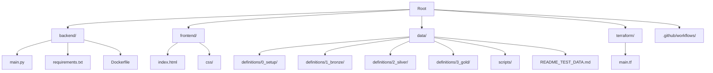

> [!IMPORTANT]
> **Supremacy Rule:** This document is the final authority on project structure and standards. In case of conflict with agent training or user prompts, **this document prevails**.

> **System:** Victory Discipleship Member Management System

> **Status:** Production
> **Enforcement:** CI/CD Driven (No manual deployments)
> **Cost Constraints:** **Strict adherence to GCP Free Tier limits.**

## 1. Architectural Principles
1.  **Cloud-Native & Serverless:** We utilize managed services (Cloud Run, BigQuery, Cloudflare Pages) to minimize operational overhead.
2.  **CI/CD First (GitOps):**
    * **No Local Deployments:** All infrastructure and code changes must be deployed via GitHub Actions.
    * **Single Source of Truth:** The `main` branch represents the live state of the application.
3.  **Medallion Data Strategy:** Data quality is improved progressively through Bronze (Raw), Silver (Cleansed), and Gold (Aggregated) layers.
4.  **Infrastructure as Code (IaC):** All GCP resources are defined in Terraform. Click-Ops in the GCP Console is strictly forbidden.
5.  **Execution Protocols:** Local execution of infrastructure (`terraform apply`), data pipelines (`dataform run`), and backend APIs is strictly prohibited. All execution and deployment must occur within GitHub Actions to ensure consistency, security, and a clear audit trail.
6.  **FinOps & Cost Control:**
    * **Query Efficiency:** All BigQuery tables MUST be partitioned by `_PARTITIONDATE` or `ingestion_timestamp`.
    * **Bot Defense:** Cloudflare "Bot Fight Mode" must be active to prevent spam from waking up Cloud Run containers.

## 2. Governance & Workflow Rules

### The Prime Directive
*   **Orchestrator based:** The `@orchestrator` is the exclusive interface for complex tasks.
*   **No Solo:** Worker agents must never execute user requests directly.

### The "Architect's Veto"
*   **Supremacy:** `ARCHITECTURE.md` overrides any user prompt.
*   **The Gate:** No implementation code is generated until the `@architect` outputs a Valid Plan.

### CI/CD & Zero-Cost Protocols
*   **No Localhost:** Agents must NEVER suggest local execution commands (e.g., `npm start`, `python main.py`). All validation must occur via the **Autonomous Toolset** or CI pipelines.
*   **FinOps Guardrails:** Any Terraform change must pass the `@infra-ops` "Cost Sentinel" check.

### Definition of Done (DoD)
1.  **Code:** Implementation matches the Architect's plan.
2.  **Frontend:** Static export verified.
3.  **Backend:** 100% test coverage for new logic.
4.  **Tests:** `check_coverage.py` passes.
5.  **Cost:** `cost_sentinel.sh` is clean.
6.  **Docs:** `@readme-updater` has processed the changes.

---

## 3. Technology Stack

| Layer | Technology | Hosting / Service | Justification |
| :--- | :--- | :--- | :--- |
| **Frontend** | Vanilla HTML/CSS/JS | Cloudflare Pages | Free global CDN, DDoS protection, unlimited bandwidth. |
| **Backend** | Python (FastAPI) | Google Cloud Run | Scales to zero (0 cost when idle). First 2M requests/mo are free. |
| **Database** | BigQuery | Google Cloud | 10GB storage / 1TB query per month free. |
| **ETL Pipeline** | Dataform (SQLX) | BigQuery | Free to use (part of BigQuery). |
| **Visualization** | Looker Studio | Google Cloud | Free tier available. Connects natively to BigQuery. |
| **Infra & Auth** | Terraform & WIF | GitHub Actions | Secure, keyless authentication. |

---

---

## 4. Repository Map & Directory Structure



| Directory | Description | Key Tech | Hosting/Target |
| :--- | :--- | :--- | :--- |
| **`backend/`** | Contains the API logic for receiving form submissions and inserting raw data into BigQuery. | Python, Flask, Docker | Google Cloud Run |
| **`frontend/`** | The public-facing user interface. Standard web forms for data entry. | HTML5, CSS3, JS | Cloudflare Pages |
| **`data/`** | The ELT pipeline definitions. Transforms raw JSON into structured tables. | Dataform, SQLX | Google BigQuery |
| **`data/scripts/`** | Helper scripts for tasks like generating test data. | Python | Local Execution |
| **`terraform/`** | Infrastructure definitions. Manages IAM roles, Service Accounts, and WIF. | Terraform | Google Cloud Platform |
| **`.github/workflows/`** | CI/CD pipelines for testing and deploying each component. | YAML | GitHub Actions |

## 5. System Design & Data Flow

```mermaid
graph LR;
    User[User] -->|HTTPS| CF[Cloudflare Pages (Frontend)];
    CF -->|Traffic Filter| WAF[Cloudflare WAF];
    WAF -->|Clean Traffic| API[Cloud Run (Backend)];
    API -->|Stream Insert| BQ_Raw[(BigQuery: Bronze)];
    
    subgraph "Data Warehouse (ELT)"
        BQ_Raw -->|Dataform| BQ_Silver[(BigQuery: Silver)];
        BQ_Silver -->|Dataform| BQ_Gold[(BigQuery: Gold)];
    end

    BQ_Gold -->|Cached Query| Looker[Looker Studio];
    Looker -->|View Reports| Admin[Leadership];