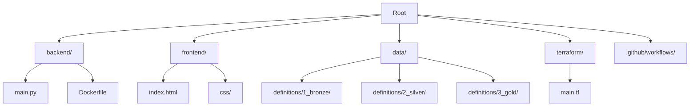

# Victory Discipleship Member Management System

> [!IMPORTANT]
> **AI Agent Instructions**: This README is the **single source of truth** for this repository. When analyzing the codebase, troubleshooting, or planning changes, **ALWAYS** check this document first to understand the directory structure, architectural patterns, and deployment workflows.

## 1. Project Overview

The **Victory Discipleship Member Management System** is a full-stack application designed to manage church member data. It ingests data from a public-facing website, processes it through a data warehouse pipeline, and creates actionable insights.

### Technology Stack

*   **Frontend**: Vanilla HTML/CSS/JavaScript. Hosted on **Cloudflare Pages** for free global CDN and DDoS protection.
*   **Backend**: Python (FastAPI) running on **Google Cloud Run**. Scales to zero for 100% cost efficiency when idle.
*   **Data Warehouse**: Google BigQuery, utilizing Free Tier limits (10GB storage / 1TB query per month).
*   **Data Pipeline**: **Dataform** (using SQLX) following the **Medallion Architecture** (Bronze $\rightarrow$ Silver $\rightarrow$ Gold).
*   **Visualization**: **Looker Studio**. Native BigQuery connection, utilizing cached queries for cost control.
*   **Infrastructure**: **Terraform** for Infrastructure-as-Code (IaC) on Google Cloud Platform (GCP).
*   **Security & WAF**: **Cloudflare WAF** with Bot Fight Mode enabled to protect backend resources.
*   **CI/CD**: GitHub Actions with **Workload Identity Federation (WIF)** for secure, keyless authentication.

---

## 2. Repository Map & Directory Structure

This repository is organized by architectural layer.



### 📂 Directory Descriptions

| Directory | Description | Key Tech | Hosting/Target |
| :--- | :--- | :--- | :--- |
| **`backend/`** | Contains the API logic for receiving form submissions and inserting raw data into BigQuery. | Python, Flask, Docker | Google Cloud Run |
| **`frontend/`** | The public-facing user interface. Standard web forms for data entry. | HTML5, CSS3, JS | Cloudflare Pages |
| **`data/`** | The ELT pipeline definitions. Transforms raw JSON into structured tables. | Dataform, SQLX | Google BigQuery |
| **`terraform/`** | Infrastructure definitions. Manages IAM roles, Service Accounts, and WIF. | Terraform | Google Cloud Platform |
| **`.github/workflows/`** | CI/CD pipelines for testing and deploying each component. | YAML | GitHub Actions |

---

## 3. Architecture & Data Flow

### Medallion Architecture
We strictly follow the **Medallion Architecture** pattern for our data pipeline:

1.  **Bronze Layer (Raw)**:
    *   **Source**: `backend/main.py` inserts raw JSON payloads here.
    *   **Schema**: `definitions/1_bronze/`. Contains `ingestion_timestamp`, `payload` (JSON), and `metadata`.
    *   **Partitioning**: MUST be partitioned by `ingestion_timestamp` or `_PARTITIONDATE` for query efficiency.
    *   **Goal**: Immutable, append-only store of all incoming data.
2.  **Silver Layer (Cleansed)**:
    *   **Dataform**: `definitions/2_silver/`.
    *   **Goal**: Parsed JSON, deduplicated records, type casting, and data quality assertions.
3.  **Gold Layer (Curated)**:
    *   **Dataform**: `definitions/3_gold/`.
    *   **Goal**: Aggregated stats, business-level metrics, and views ready for Looker Studio.

### Coding Standards & FinOps
*   **General**: Follow Industry Best Practices. Keep code DRY (Don't Repeat Yourself), Clean, and Modular.
*   **FinOps**: Adhere to GCP Free Tier limits. Avoid unnecessary full-table scans in BigQuery.
*   **BigQuery**: All tables MUST be partitioned. Use lower-case identifiers.
*   **Python**: Follow **PEP 8** style guidelines. Use FastAPI for backend logic.
*   **SQL**: Use standard SQL formatting. Upper-case keywords.
*   **HTML/CSS**: Use Semantic HTML tags. CSS should be organized and specific.
*   **Commits**: Use conventional commit messages if possible.

---

## 4. Development Workflow

### Prerequisites

To work on this repository, you must have the following tools installed:

1.  **[Google Cloud SDK (gcloud)](https://cloud.google.com/sdk/docs/install)**: For interacting with GCP resources.
3.  **[HashiCorp Terraform](https://developer.hashicorp.com/terraform/downloads)**: For infrastructure management.

### 🛠️ Setup Instructions

#### 1. Backend (FastAPI)
*   **Exclusive Execution**: The backend runs exclusively on **Google Cloud Run**. Local execution of the API is prohibited to maintain environment parity and security.
*   **Deployment**: Automated via GitHub Actions on every push to `main` that modifies the `backend/` directory.

#### 2. Frontend (Static)
*   Simply open `frontend/index.html` in your browser.
*   For development, you can use a simple HTTP server:
    ```bash
    cd frontend
    python -m http.server 3000
    ```

#### 3. Dataform (Pipeline)
*   **Exclusive Execution**: Dataform runs exclusively via **GitHub Actions** whenever code is pushed to the `main` branch or a Pull Request is created.
*   **Validation**: Schema validation and compilation checks are performed automatically in the `Compile Dataform` job of the CI/CD pipeline. No local installation of the Dataform CLI is required.

#### 4. Infrastructure (Terraform)
*   **Local Validation**: You can use Terraform locally for linting and planning only.
    ```bash
    cd terraform
    terraform init
    terraform plan
    ```
*   **Exclusive Execution**: `terraform apply` is **strictly prohibited** locally. Infrastructure changes are applied exclusively via GitHub Actions upon merging to the `main` branch.

---

## 5. Deployment & Secrets

### GitHub Actions Secrets
The following secrets MUST be configured in the GitHub Repository settings for CI/CD to work:

| Secret Name | Description | Required By |
| :--- | :--- | :--- |
| **`WIF_PROVIDER`** | The full GCP resource name of the Workload Identity Provider. | `deploy_backend.yaml`, `dataform.yaml` |
| **`WIF_SERVICE_ACCOUNT`** | The Service Account email that GitHub Actions impersonates. | `deploy_backend.yaml`, `dataform.yaml` |
| **`GCP_PROJECT_ID`** | The Google Cloud Project ID (e.g., `victory-discipleship`). | `deploy_backend.yaml` |
| **`GCP_CREDENTIALS`** | (Optional/Legacy) Raw JSON Service Account key. Prefer WIF where possible. | `deploy_backend.yaml` |

### Deployment Targets
*   **Backend**: Automatically deployed to **Cloud Run** on pushing to `main` (if changes are in `backend/`).
*   **Frontend**: Deployed to **Cloudflare Pages** (configured via Cloudflare Dashboard linked to this repo).
*   **Data Pipeline**: Compiled and run via **GitHub Actions** on pushing to `main` (if changes are in `data/`). This is the **only** environment where Dataform is executed.

---

> [!NOTE]
> **Troubleshooting Tip**: If the backend fails to deploy, check the `WIF_PROVIDER` and `WIF_SERVICE_ACCOUNT` secrets first. Ensure the Service Account has the `roles/run.developer` and `roles/iam.serviceAccountUser` roles.