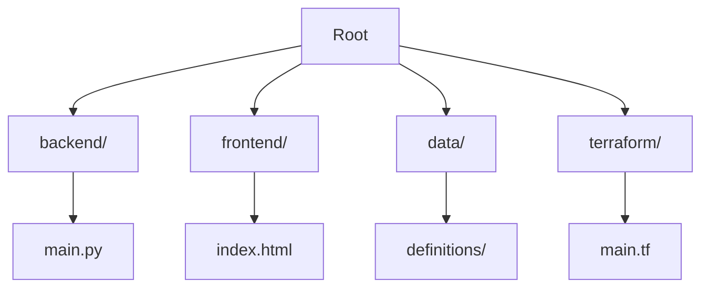

# Victory Discipleship Member Management System

> [!IMPORTANT]
> **AI Agent Instructions**: This README is the **single source of truth** for this repository. When analyzing the codebase, troubleshooting, or planning changes, **ALWAYS** check this document first to understand the directory structure, architectural patterns, and deployment workflows.

## 1. Project Overview

The **Victory Discipleship Member Management System** is a full-stack application designed to manage church member data. It ingests data from a public-facing website, processes it through a data warehouse pipeline, and creates actionable insights.

### Technology Stack

*   **Frontend**: Vanilla HTML/CSS/JavaScript. Hosted on **Cloudflare Pages** for free global CDN and DDoS protection.
*   **Backend**: Python (Flask) running on **Google Cloud Run**. Scales to zero for 100% cost efficiency when idle.
*   **Data Warehouse**: Google BigQuery, utilizing Free Tier limits (10GB storage / 1TB query per month).
*   **Data Pipeline**: **Dataform** (using SQLX) following the **Medallion Architecture** (Bronze $\rightarrow$ Silver $\rightarrow$ Gold).
*   **Visualization**: **Looker Studio**. Native BigQuery connection, utilizing cached queries for cost control.
*   **Infrastructure**: **Terraform** for Infrastructure-as-Code (IaC) on Google Cloud Platform (GCP).
*   **Security & WAF**: **Cloudflare WAF** with Bot Fight Mode enabled to protect backend resources.
*   **CI/CD**: GitHub Actions with **Workload Identity Federation (WIF)** for secure, keyless authentication.

---

## 2. Architecture & Standards

> [!NOTE]
> For a detailed breakdown of the **Medallion Architecture**, **Technology Stack**, and **Governance Rules**, please refer to the [ARCHITECTURE.md](ARCHITECTURE.md) file.

### Repository Map



For a detailed file-by-file breakdown, see [ARCHITECTURE.md Section 10 (Repository Structure)](#10-cicd-pipeline--github-actions--terraform).

---

## 3. Agent Orchestration

This project uses a multi-agent workflow system coordinated by the `@orchestrator` agent to manage complex tasks while maintaining architectural standards.

### Available Agent SKILLs

All agent definitions are located in `.agent/skills/`. Each agent has specific responsibilities:

| Agent | Responsibility | Key Tools |
| :--- | :--- | :--- |
| **@orchestrator** | Workflow manager; coordinates agents and manages lifecycle | `generate_context.sh` |
| **@architect** | Technical authority; enforces standards and validates structure | `validate_structure.py` |
| **@frontend-dev** | Frontend implementation (HTML/CSS/JS - Static) | `validate_static_page.sh` |
| **@backend-dev** | Backend logic implementation (FastAPI, Python); Test-Driven | `run_backend_tests.sh` |
| **@data-engineer** | Manages Dataform pipelines and Looker compatibility | `impact_analysis.sh`, `find_lineage.sh`, `schema_lint.py` |
| **@infra-ops** | Manages Terraform and enforces Free Tier constraints | `cost_sentinel.sh` |
| **@qa-engineer** | Writes and maintains test suite (Pytest/Playwright); **SonarQube quality gate enforcement** | `check_coverage.py`, **SonarQube MCP tools** |
| **@bi-analyst** | Transforms data into Looker Studio visualizations | `generate_looker_spec.py` |
| **@readme-updater** | Updates README.md and verifies documentation integrity | `check_links.py` |
| **@code-watcher** | Continuously monitors /src for file modifications | (monitoring only) |

### Standard Workflows

The project includes predefined workflows in `.agent/workflows/`:

*   **`/feature-development`** - Standard instructions for implementing a new feature from idea to production
*   **`/data-pipeline-evolution`** - Guide for evolving the data warehouse schema
*   **`/mcp-integration`** - Guide for using Model Context Protocol (MCP) tools for BigQuery and GitHub
*   **`/sonarqube-quality-gate`** - Guide for running SonarQube analysis and checking quality gates
*   **`/feature-branch-workflow`** - Standard workflow for feature branch development and Pull Requests

### Agent Triggering (Routing Matrix)

Agents are automatically invoked based on file paths being modified. See [`.agent/rules/persistence.md` Section 5](.agent/rules/persistence.md#5-routing-matrix-mandatory) for the complete routing matrix.

**Common triggers:**
*   `backend/**` → `@backend-dev`
*   `frontend/**` → `@frontend-dev`
*   `data/definitions/**` → `@data-engineer`
*   `terraform/**` OR `resources/**` → `@infra-ops`
*   `.github/workflows/**` → `@infra-ops` + `@qa-engineer`

### Working with Agents

1.  **For complex tasks:** Invoke `@orchestrator` which will coordinate the necessary agents
2.  **For feature development:** Use the `/feature-development` workflow for structured guidance
3.  **For data changes:** Use the `/data-pipeline-evolution` workflow and consult `@data-engineer`
4.  **Documentation updates:** `@readme-updater` is automatically triggered based on file changes (see routing matrix)

Refer to `.agent/rules/persistence.md` for detailed governance rules and agent protocols.

### Feature Branch Workflow

This project uses a feature branch workflow with Pull Requests for all changes.

#### Creating a Feature Branch

1. **Ensure you're on main and up to date:**
   ```bash
   git checkout main
   git pull origin main
   ```

2. **Create a new feature branch:**
   ```bash
   git checkout -b <type>/<description>
   ```
   
   **Branch Types:**
   - `feature/` - New features or enhancements
   - `fix/` - Bug fixes
   - `docs/` - Documentation updates
   - `refactor/` - Code refactoring
   - `test/` - Test additions or updates
   - `chore/` - Maintenance tasks

3. **Make your changes and commit:**
   ```bash
   git add .
   git commit -m "feat: your feature description"
   ```

4. **Push to GitHub:**
   ```bash
   git push origin <your-branch-name>
   ```

5. **Create a Pull Request:**
   - Go to GitHub repository
   - Click "Compare & pull request"
   - Wait for automated checks to pass:
     - ✅ SonarQube Quality Gate
     - ✅ Test Coverage
     - ✅ Dataform Compilation (if applicable)
     - ✅ Backend Tests (if applicable)

6. **Merge the PR:**
   - Once all checks pass, merge the PR
   - Delete the feature branch after merge

**Note:** Direct pushes to `main` are blocked by branch protection rules. See `/feature-branch-workflow` for detailed instructions.

---

## 4. API Documentation

### Public Web Pages

*   **Member Registration Form:** `https://<your-cloudflare-pages-url>/`
    *   Purpose: Allows church members to self-register their information
    *   Access: Public (no authentication required)
    *   Features: Collects demographics, occupation, ministry preferences, discipleship classes

*   **Admin Member Management:** `https://<your-cloudflare-pages-url>/admin.html`
    *   Purpose: Search and update existing member records
    *   Access: **Protected via Cloudflare Access** (authorized staff only)
    *   Features: Email-based search, pre-filled update forms, append-only architecture
    *   Note: Updates are not immediately reflected in search until Dataform pipeline runs

### Backend API Endpoints

Backend is hosted on **Google Cloud Run** at `https://<cloud-run-service-url>`.

| Endpoint | Method | Purpose | Authentication | Request | Response |
| :--- | :--- | :--- | :--- | :--- | :--- |
| `/api/submit` | POST | Submit member data | None (public) | JSON payload (see schema below) | `{"message": "Success", "row_id": "..."}` |
| `/api/search` | GET | Search members by email | None* | Query: `?email=xxx@example.com` | JSON array of member records |
| `/health` | GET | Health check | None | N/A | `{"status": "healthy"}` |

*Note: `/api/search` is conceptually admin-only, but authentication is enforced at the frontend level via Cloudflare Access, not at the API layer.*

For complete API contracts and authentication model, see [ARCHITECTURE.md Section 7](ARCHITECTURE.md#7-backend--cloud-run--fastapi).

---

## 5. Development Workflow

### Prerequisites

To work on this repository, you must have the following tools installed:

1.  **[Google Cloud SDK (gcloud)](https://cloud.google.com/sdk/docs/install)**: For interacting with GCP resources.
3.  **[HashiCorp Terraform](https://developer.hashicorp.com/terraform/downloads)**: For infrastructure management.

### 🛠️ Setup Instructions

#### 1. Backend (FastAPI)
*   **Exclusive Execution**: The backend runs exclusively on **Google Cloud Run**. Local execution of the API is prohibited to maintain environment parity and security.
*   **Deployment**: Automated via GitHub Actions on every push to `main` that modifies the `backend/` directory.

#### 2. Frontend
*   Simply open `frontend/index.html` in your browser.
*   For development, you can use a simple HTTP server:
    ```bash
    cd frontend
    python -m http.server 3000
    ```

#### 3. Dataform (Pipeline)
*   **Exclusive Execution**: Dataform runs exclusively via **GitHub Actions** whenever code is pushed to the `main` branch or a Pull Request is created.
*   **Validation**: Schema validation and compilation checks are performed automatically in the `Compile Dataform` job of the CI/CD pipeline. No local installation of the Dataform CLI is required.

#### 4. Infrastructure (Terraform)
*   **Local Validation**: You can use Terraform locally for linting and planning only.
    ```bash
    cd terraform
    terraform init
    terraform plan
    ```
*   **Exclusive Execution**: `terraform apply` is **strictly prohibited** locally. Infrastructure changes are applied exclusively via GitHub Actions upon merging to the `main` branch.

---

## 6. Deployment & Secrets

### Cloudflare Pages (Frontend)

*   **Automatic Deployment:** Cloudflare Pages is configured to auto-deploy from the `main` branch.
*   **Build Settings:**
    *   Build command: (None - static files)
    *   Build output directory: `frontend/`
    *   Root directory: `/`
*   **Admin Page Protection:**
    *   The `admin.html` page is protected using **Cloudflare Access**.
    *   Configuration: Cloudflare Dashboard → Access → Applications → Create Application
    *   Policy: Define authorized emails/groups who can access `/admin.html`

### GitHub Actions Secrets
The following secrets MUST be configured in the GitHub Repository settings for CI/CD to work:

| Secret Name | Description | Required By |
| :--- | :--- | :--- |
| **`WIF_PROVIDER`** | The full GCP resource name of the Workload Identity Provider. | `dataform.yaml` |
| **`WIF_SERVICE_ACCOUNT`** | The Service Account email that GitHub Actions impersonates. | `dataform.yaml` |
| **`GCP_PROJECT_ID`** | The Google Cloud Project ID (e.g., `victory-discipleship`). | `deploy_backend.yaml`, `dataform.yaml` |
| **`GCP_CREDENTIALS`** | Raw JSON Service Account key. | `deploy_backend.yaml` |
| **`GCP_LOCATION`** | The Google Cloud location (e.g., `asia-southeast1`). | `dataform.yaml` |
| **`SONAR_TOKEN`** | SonarQube Cloud authentication token | `sonarqube-analysis.yaml` |
| **`SONAR_ORGANIZATION`** | SonarQube Cloud organization key (e.g., `evan-07`) | `sonarqube-analysis.yaml` |
| **`SONAR_PROJECT_KEY`** | SonarQube Cloud project key (e.g., `evan-07_victory-discipleship`) | `sonarqube-analysis.yaml` |

### Deployment Targets
*   **Backend**: Automatically deployed to **Cloud Run** on pushing to `main` (if changes are in `backend/`). Can be manually triggered via **Workflow Dispatch**.
*   **Frontend**: Deployed to **Cloudflare Pages** (configured via Cloudflare Dashboard linked to this repo).
*   **Data Pipeline**: Compiled on Pull Requests. Runs via **GitHub Actions** on pushing to `main` (if changes are in `data/`). This is the **only** environment where Dataform is executed.

---

> [!NOTE]
> **Troubleshooting Tip**: If the backend fails to deploy, check the `WIF_PROVIDER` and `WIF_SERVICE_ACCOUNT` secrets first. Ensure the Service Account has the `roles/run.developer` and `roles/iam.serviceAccountUser` roles.