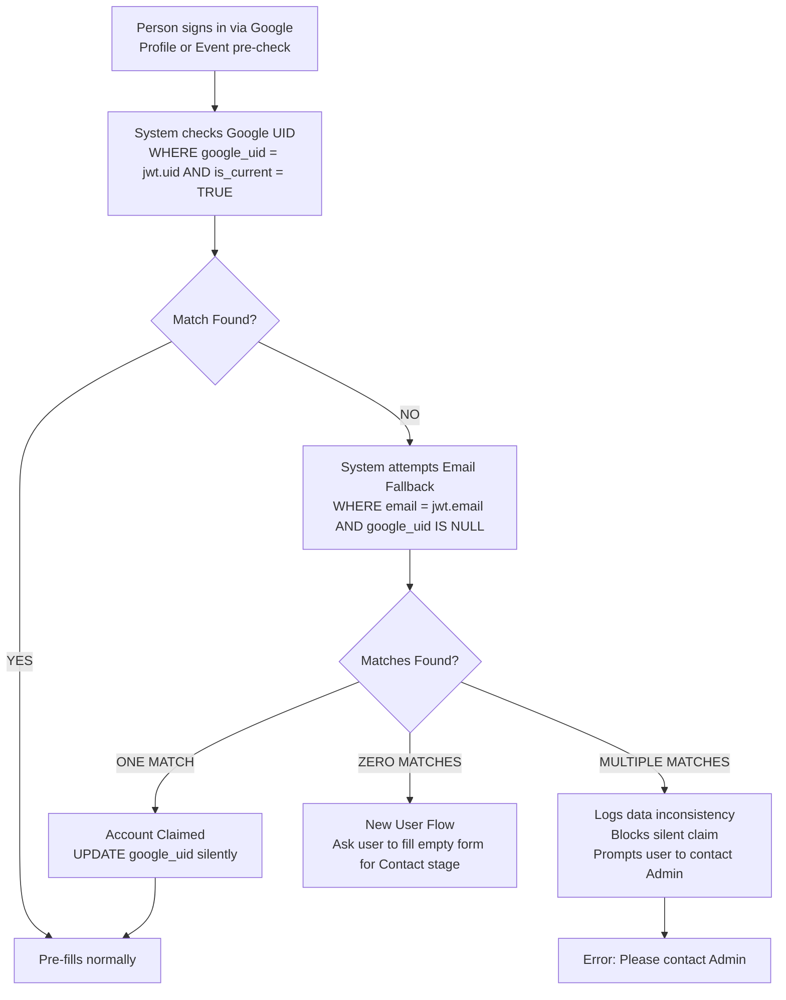
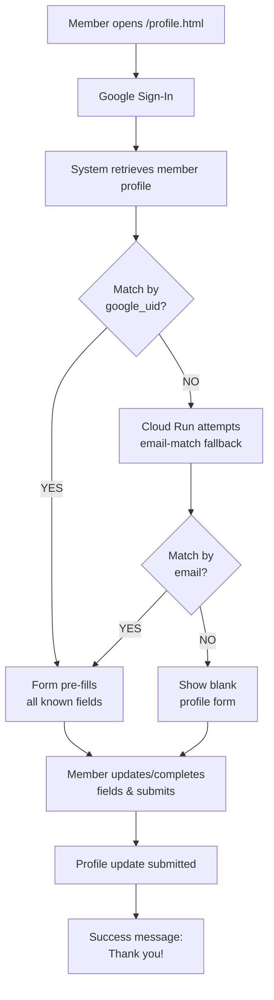
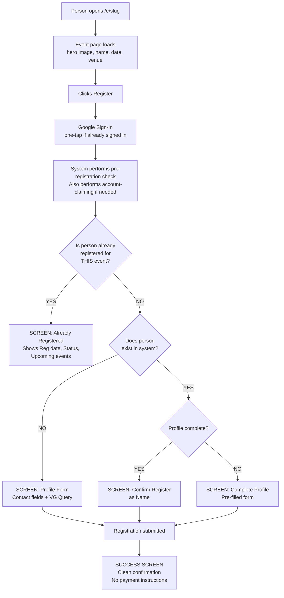
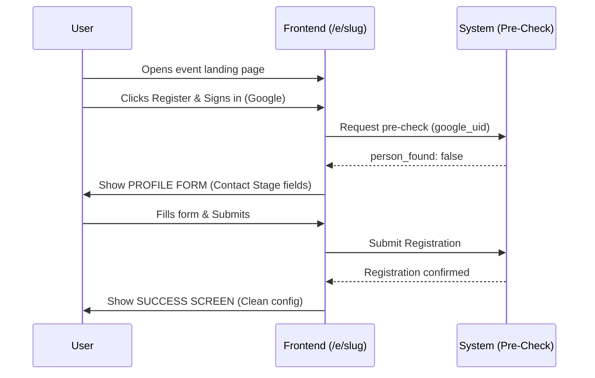
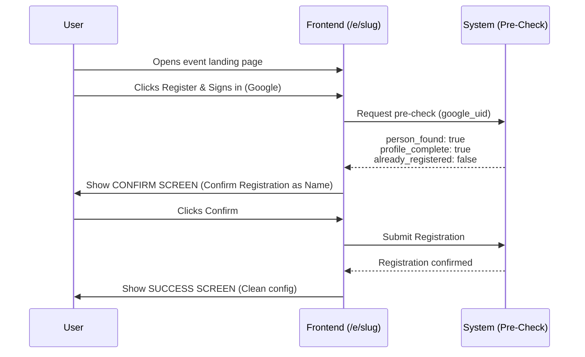
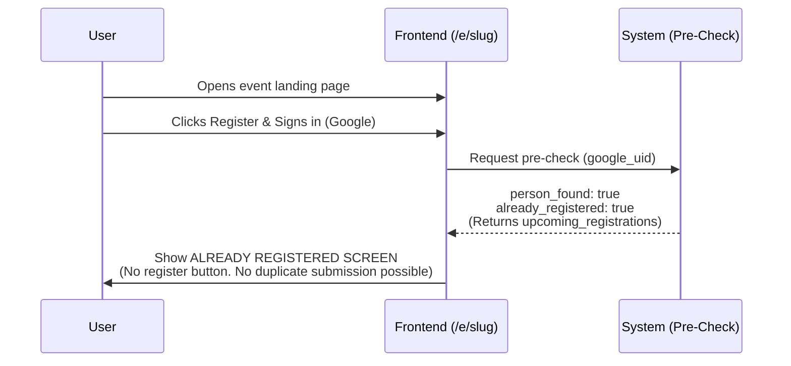
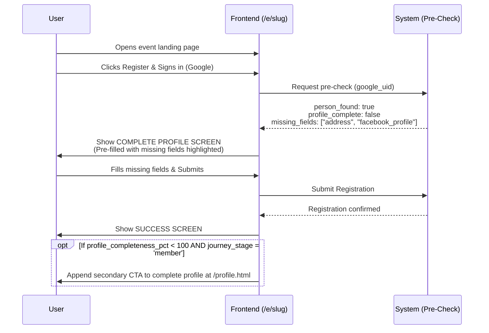
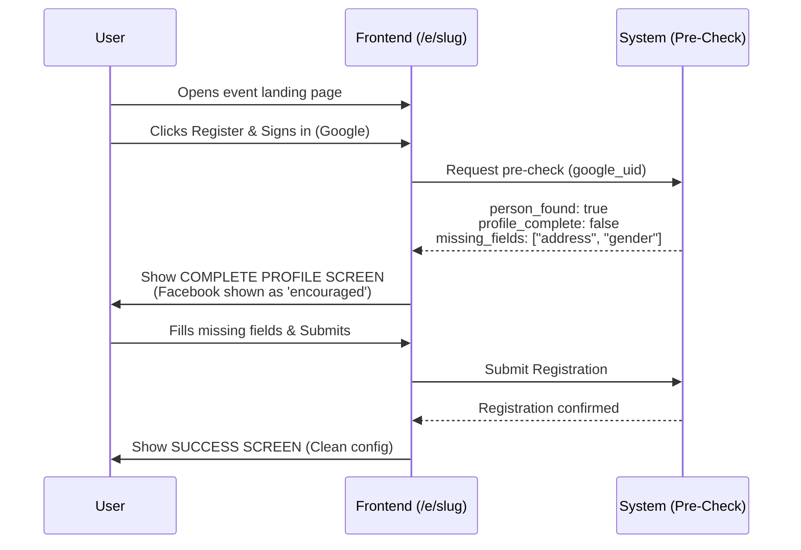
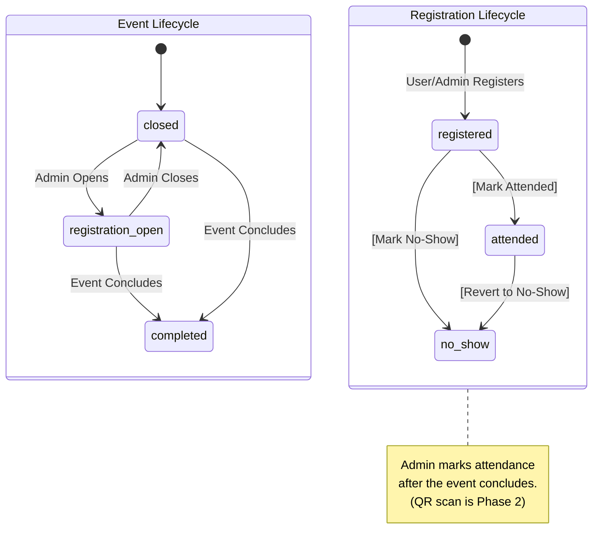
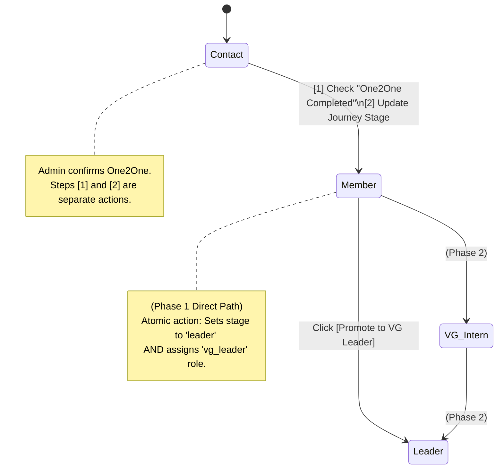

# Frontend & UX Flows — Phase 1 (Release Slices 1.01–1.08)

← Part of [ARCHITECTURE.md](../ARCHITECTURE.md) | See also: [UX_FLOWS.md](UX_FLOWS.md) · [API.md](API.md) · [JOURNEY_STAGES.md](JOURNEY_STAGES.md) · [EVENTS.md](EVENTS.md)

---

## Phase 1.01 — Foundation: Auth + Skeleton Pages

| Page | Who Sees It | Access Control | Phase | Notes |
| :--- | :--- | :--- | :--- | :--- |
| `/e/[slug]` | Anyone | Google Sign-In | **Phase 1.01** | Public event landing shell — no nav. Register CTA enforces sign-in; full registration flow arrives in later slices. |
| `/profile.html` | Any authenticated person | Google Sign-In | **Phase 1.01 (shell), 1.04 (basic self-service)** | Starts as a shell page; basic self-service profile editing ships with registration writes. Enhanced stage-based enforcement is finalized in 1.08. |
| `/admin.html` | Admin only | Firebase Auth + role check (admin) | **Phase 1.01 (shell), 1.07–1.08 (core ops)** | Starts as a shell page; review queue lands in 1.07 and advanced person/role tools in 1.08. |
| `/events.html` | Admin only | Firebase Auth + role check (admin) | **Phase 1.01 (shell), 1.05–1.06 (core ops)** | Starts as a shell page; event setup/status controls land in 1.05 and attendance/manual registration in 1.06. |


## Phase 1 Release Slices (Implementation Order)

### Phase 1.01 — Foundation: Auth + Skeleton Pages
- Google Sign-In integration and Firebase Auth session handling.
- Route/page shells for `/e/[slug]`, `/profile.html`, `/admin.html`, and `/events.html`.
- Role gating baseline: public event page access, admin-only enforcement for `/admin.html` and `/events.html`.
- Standard sign-in failure handling (cancelled sign-in, popup blocked, network failures).

### Phase 1.02 — Event Read-Only Landing Page
- `/e/[slug]` resolves event by slug and shows hero image, event name, date/time, venue.
- Event status messaging for `closed`, `completed`, `cancelled`, and not-found states.
- `Register Now` CTA can remain a sign-in-gated stub.

### Phase 1.03 — Pre-check + Decision Screens (No Writes)
- End-to-end pre-check integration, including account-claiming fallback by email.
- Decision screens: Already Registered, Confirm Registration, Complete Profile, Brand New Person.
- Missing-field highlighting driven by pre-check response.
- No registration write operations yet.

### Phase 1.04 — Self-Service Registration Writes (Core Public MVP)
- Public registration write paths for new, incomplete-profile, and complete-profile persons.
- Minimal success screen and duplicate registration defenses.
- Mid-flow event closure/race-condition handling.
- Basic `/profile.html` self-service profile editing ships alongside this slice.

### Phase 1.05 — Admin Event Management
- `/events.html` supports event creation (default `closed`), hero upload, status transitions, and basic registration list.
- Public event page behavior reflects live admin-controlled status.

### Phase 1.06 — Attendance Marking + Admin Direct Registration
- Registration list actions: mark attended / no-show.
- Usability controls: filtering, search, and pagination.
- Admin direct registration flow (person search + duplicate guard).

### Phase 1.07 — Admin Review Queue MVP
- `/admin.html` review queue with Pending and Duplicates tabs.
- Rejected records audit view with restore path.
- Duplicate routing and optimistic UI + rollback error messaging.

### Phase 1.08 — Admin Person Record Power Tools
- Expanded admin person editing and stage transition actions.
- Role assignment/revocation for Admin and Executive.
- `Promote to VG Leader` direct action and role/stage mismatch repair guidance.

### Shortest Realistic MVP Cut
- **1.01 → 1.02 → 1.03 → 1.04 → 1.05** delivers the first complete operational loop: shareable event page, smart pre-check, registration writes, and admin event control.
- Add **1.06** for attendance operations, **1.07** for data quality stabilization, and **1.08** for scale-oriented admin power tools.

---
### Event Page Design

```plaintext
Admin's job                          Creative team's job
─────────────────────────────────    ──────────────────────────────────
Create event in portal               Design event artwork in Canva
System auto-generates page_slug      Export as image, send to admin
Upload Canva-designed hero image     Admin uploads it — page is live
Set status = registration_open       Creative team never touches code
Copy URL → hand to comms team        Zero developer required
```
### Event Landing Page Layout (`/e/[slug]`)

```plaintext
┌─────────────────────────────────────────┐
│         [Canva Hero Image]              │
│                                         │
│  Event Name                             │
│  Date & Time · Venue                    │
│  (Admin-uploaded hero image fills the   │
│   visual context — Phase 2+: description│
│   field not in schema for Phase 1)      │
│                                         │
│  ┌─────────────────────────────┐        │
│  │   [ Register Now ]          │        │
│  └─────────────────────────────┘        │
│                                         │
│  No payment instructions displayed.     │
│  No site navigation.                    │
└─────────────────────────────────────────┘
```


## UX Flows (Phase 1 Detailed Reference)
### Entry Points Summary

| Entry Point | URL | Who | Auth | Key Behavior | Phase |
| :--- | :--- | :--- | :--- | :--- | :--- |
| Event Landing Page | `/e/[slug]` | Anyone | Google Sign-In | Smart pre-check → profile form or confirm or already-registered screen. VG question for new users. | **1.02–1.04** |
| Member Profile | `/profile.html` | Any authenticated person | Google Sign-In | View and update own record. Pre-fills from Silver. Accessible to all authenticated persons with a Silver record. Field requirements vary by journey_stage — see Field display rules. Cannot see other records. | **1.01 (shell), 1.04, 1.08** |
| Admin Portal | `/admin.html` | Admin team | Google Sign-In + admin role | Review queue, event management, person editing, role assignment. | **1.01 (shell), 1.05–1.08** |

### Member Profile Form — `/profile.html`

> **Account-Claiming (admin-created records):** Account-claiming (email-match fallback) is triggered on profile load and event registration pre-check. On either action, if no record matches by `google_uid`, the system automatically attempts an email-match fallback against `persons WHERE google_uid IS NULL`. If a match is found, the `google_uid` is claimed silently and the form pre-fills normally. If no email match is found, the user is presented with a blank profile form to complete their initial registration (self-service profile creation). See [API.md](API.md) for the account-claiming flow.



> **Stage-dependent Facebook enforcement:** If the user's `journey_stage = 'contact'`, the Facebook field is shown with an "encouraged" label and is not required. If `journey_stage = 'member'` or higher, Facebook is **required** — the form submission is blocked until it is filled.

> **Profile completeness criteria — canonical field sets for `profile_complete` pre-check flag and `profile_completeness_pct` Silver formula:**
> - **Contact stage** (9 fields): `first_name`, `middle_name`, `last_name`, `address`, `birthdate`, `gender`, `civil_status`, mobile `person_contacts` record (`contact_type = 'mobile'`, `is_current = TRUE`), `persons.email`. `suffix` is excluded (form always pre-populates 'None'). Facebook is encouraged but non-blocking — not counted as required at this stage. `persons.email` is auto-captured from Google Sign-In and never shown as a form field (see field display rules below).
> - **Member stage** — adds 4 fields to contact requirements: `facebook` (`person_contacts` WHERE `contact_type = 'facebook'`, `is_current = TRUE`), `is_in_victory_group`, `employment_type`, plus one applicable conditional field (`nature_of_work` or `nature_of_business` — whichever matches `employment_type`; the inapplicable field is never counted).



**Field display rules:**
- All Contact-stage fields (first name, middle name, last name, suffix, address, contact number, birthday, gender, civil status) are shown pre-filled and editable — members may correct their own data.
- Facebook is shown pre-filled and editable. Shown with an "encouraged" label for contact-stage persons (non-blocking). Required and form-blocking for member-stage or higher.
- Email is **not shown as a form field** — it is silently captured from the Google Sign-In session (`persons.email` = Firebase Auth email). This enables a parent or spouse to register on behalf of a family member without requiring the family member to have their own Google account.

> **Proxy Registration (Register Someone Else):** Phase 1 includes a non-primary 'Register Someone Else' flow. This enables a parent or spouse to register a family member. When a proxy registers someone else, the proxy's `google_uid` must NOT be permanently bound to the family member's record. Instead, `persons.email` is stored as the proxy's email, but `google_uid` remains NULL for that new record. The actual registrant can claim their profile later via account-claiming once an admin manually updates `persons.email` to the actual registrant's email. Admins must be trained on this edge case to prevent operational friction when families register via proxy.

- "Are you part of a Victory Group?" maps to `is_in_victory_group BOOL` on `victory_silver.persons`. Does not affect `journey_stage`. Captured to report on contact-stage persons not yet in a Victory Group. NULL = not yet answered.
- Employment Type and conditional fields (Section 2) are always shown — these are the primary reason a member visits this page. For **contact-stage** persons: the section is shown but all fields are optional (non-blocking for form submission). For **member-stage or higher**: `employment_type` and the applicable conditional fields are required — the form is blocked until filled. For **employed**: `nature_of_work` and `company_name` are shown (both required). For **self-employed**: `nature_of_business` and `business_name` are shown (both required). The inapplicable pair is hidden entirely.
- A member cannot view or edit any other person's record. The form is scoped strictly to `google_uid` of the signed-in user.

**Form Dropdown Values Reference** — Canonical mapping of stored enum values to UI display labels:

| Field | Stored Value | UI Display Label |
| :--- | :--- | :--- |
| `suffix` | `(empty / NULL)` | None |
| `suffix` | `Jr.` | Jr. |
| `suffix` | `Sr.` | Sr. |
| `suffix` | `II` | II |
| `suffix` | `III` | III |
| `suffix` | `IV` | IV |
| `gender` | `M` | Male |
| `gender` | `F` | Female |
| `civil_status` | `single` | Single |
| `civil_status` | `married` | Married |
| `civil_status` | `widowed` | Widowed |
| `employment_type` | `employed` | Employed |
| `employment_type` | `self_employed` | Self-Employed |

The suffix dropdown always defaults to "None". `gender` and `civil_status` dropdowns have no default selection — admin or user must explicitly choose. `employment_type` has no default — the conditional fields (nature_of_work / nature_of_business) are hidden until a selection is made.


### Member Profile Form — Error Handling

#### Google Sign-In

| Condition | User Experience |
| :--- | :--- |
| User cancels Google Sign-In | Page returns to `/profile.html` landing with a **[ Sign In to View Your Profile ]** button re-enabled. No error message. |
| Network error during sign-in | Show inline error: *"Sign-in failed. Please check your connection and try again."* Re-enable sign-in button. |

#### Profile Load

| Condition | User Experience |
| :--- | :--- |
| `google_uid` match found | Form pre-fills normally. |
| No `google_uid` match, email match found | `google_uid` claimed silently. Form pre-fills from the matched record. No user-visible action. |
| No match at all | User is presented with a blank profile form to complete their initial registration (self-service profile creation). No error message is shown. |
| Server or network error | Show message: *"Unable to load your profile. Please check your connection and try again."* Retry button shown. |

#### Form Submission

| Condition | User Experience |
| :--- | :--- |
| Success | Show: *"Thank you, your profile has been updated."* Form fields remain pre-filled with the submitted values. |
| Client-side validation failure | Required field(s) highlighted with inline error labels. Submission blocked. No server call made. |
| Server error (5xx) | Show: *"Something went wrong. Please try again in a moment."* Form data is preserved — user does not need to re-enter. |
| Network error | Show: *"Unable to submit. Please check your connection and try again."* Form data preserved. |

---

### Event Registration Flow — Complete Decision Tree

> **Facebook field — stage-aware enforcement:** Facebook Profile is non-blocking for event registration by Contact-stage persons. The pre-check endpoint does not include `facebook_profile` in `missing_fields` and does not affect `profile_complete` for persons with `journey_stage = 'contact'`. For persons at `journey_stage = 'member'` or higher, Facebook is required and will appear in `missing_fields` if absent.

> **Event registration `profile_complete` scope — CONTACT-STAGE CRITERIA ONLY:** The pre-registration check evaluates `profile_complete` using **contact-stage criteria only** (9 fields: `first_name`, `middle_name`, `last_name`, `address`, `birthdate`, `gender`, `civil_status`, mobile `person_contacts` record, `persons.email`), regardless of the person's `journey_stage`. Employment fields (`employment_type`, `nature_of_work`, `nature_of_business`) **never appear in `missing_fields` for event registration** — even for member-stage persons. Member-stage profile completeness (which includes these 4 additional fields) is enforced exclusively at `/profile.html`. This design prevents an unresolvable UX state: a member-stage person missing employment data can still complete registration (those fields are not shown on the event form), and is separately prompted to complete their full profile at `/profile.html`. See [API.md](API.md) for the full pre-check response schema.



### Event Registration — Error Handling

#### Google Sign-In Failure or Cancellation

| Condition | User Experience |
| :--- | :--- |
| User cancels Google Sign-In dialog | Sign-in modal closes. Page returns to event landing with **[ Register Now ]** button re-enabled. No error message. |
| Network error during sign-in | Show inline error: *"Sign-in failed. Please check your connection and try again."* Re-enable **[ Register Now ]** button. |
| Popup blocked by browser | Show inline message: *"Your browser blocked the sign-in popup. Please allow popups for this site and try again."* |

No registration data is written on failure. The user may retry without page reload.

#### Event Page — Not Found or Closed

| Condition | User Experience |
| :--- | :--- |
| Event slug does not exist | Show page: *"This event page could not be found. The link may be incorrect or the event may no longer be available."* No Register button. |
| Event `status = closed` | Show event details (hero image, name, date) with message: *"Registration for this event is now closed."* No Register button. |
| Event `status = completed` | Show event details with message: *"This event has already taken place."* No Register button. |
| Event `status = cancelled` | Show message: *"This event has been cancelled. Please check with your Victory Group leader for updates."* No Register button. |

#### Pre-Check and Registration Failures

| Condition | User Experience |
| :--- | :--- |
| During pre-check — matched record is rejected (`review_status = 'rejected'`) | Show inline error: *"Unable to process registration at this time. Please contact your VG leader or an administrator."* Re-enable **[ Register Now ]** button. No registration data written. |
| During pre-check — server error (5xx) | Show inline error: *"Something went wrong. Please try again in a moment."* Re-enable **[ Register Now ]** button. No registration data written. |
| During pre-check — network error / timeout | Show inline error: *"Unable to reach the server. Please check your connection and try again."* Re-enable **[ Register Now ]** button. |
| During registration submit — server error (5xx) | Show inline error on the Confirm or Complete Profile screen: *"Something went wrong. Your registration was not submitted. Please try again."* Form data preserved — user does not need to re-enter. Do not navigate away from current screen. |
| During registration submit — network error / timeout | Show inline error: *"Unable to submit. Please check your connection and try again."* Form data preserved. Do not navigate away from current screen. |
| Duplicate registration (defensive) | Show inline message: *"It looks like you're already registered for this event."* No duplicate registration created. User may safely dismiss and navigate away. |
| Event status changed mid-flow (race condition) | Event was open when the page loaded but closed before the submit completed. Show inline error: *"Registration for this event is now closed."* Re-enable **[ Register Now ]** button. No registration data written. |

No registration data is written on pre-check or self-register failure. The user may retry without page reload. After a failed pre-check, the user is returned to the **[ Register Now ]** button state and can re-initiate the flow.

### Scenario 1 — Brand New Person



### Scenario 2 — Returning Person, Complete Profile, NOT Registered



**Note on `upcoming_registrations` on the Confirm Screen:** This list excludes the current event being registered for (since registration has not yet been submitted). After successful registration, the current event appears in `upcoming_registrations` — as shown in Scenario 3's Already Registered screen.

### Scenario 3 — Returning Person, ALREADY Registered for This Event



### Scenario 4 — Returning Person, Incomplete Profile

> *This scenario assumes the returning person is at `journey_stage = 'member'` or higher — which is why `facebook_profile` appears in `missing_fields` as a required field. Note: employment fields do **not** appear in `missing_fields` even for member-stage persons — pre-check uses contact-stage criteria only. See pre-check scope note above.*



**Note on employment fields in this screen:** The Complete Profile screen does not show the employment section, even for member-stage persons. Pre-check uses contact-stage criteria only. Employment and VG leader fields are enforced exclusively at `/profile.html`.

### Scenario 4b — Returning Person (Contact Stage), Incomplete Profile

> *Applies when `person_found: true`, `profile_complete: false`, and `journey_stage = 'contact'`. Facebook appears as "encouraged" (non-blocking) — it will NOT appear in `missing_fields` for contact-stage persons.*



Key difference from Scenario 4: Facebook is shown as "encouraged" (non-blocking). Pre-check does not include `facebook_profile` in `missing_fields`. No employment section is shown — that is a member-stage requirement.

---

### Success Screen — All Scenarios
The success screen is intentionally minimal. No payment instructions, no GCash numbers, no bank transfer details are shown on this screen.
```plaintext
┌─────────────────────────────────────┐
│                                     │
│            ✅                       │
│                                     │
│  You are registered for             │
│  Date Talk — February 2025!         │
│                                     │
│  📅 February 15, 2025 · 2:00 PM    │
│  📍 Victory Taguig                  │
│                                     │
│  See you there!                     │
│                                     │
└─────────────────────────────────────┘
```

Why no payment instructions on the success screen: Payment details (GCash numbers, bank accounts) are communicated through the church's existing channels — social media announcements, event descriptions, or in-person communication. The registration system focuses purely on confirming attendance intent. This keeps the success screen clean, reduces confusion, and avoids displaying sensitive financial information on a public-facing page.


### Admin Review Queue

> **Phase 1:** Tab 1 (Pending Records) and Tab 2 (Duplicates) are required for MVP — all public event registrations and admin-created records flow through here.
> **Phase 2:** Tab 3 (Unresolved Interns), Tab 4 (Interns Without Active Relationship), and Tab 5 (Unlinked VG Members) activate when the VG Leader form ships in Phase 2.

Records created by **public forms** (event registration) start as `review_status = 'pending'`. The admin portal surfaces these records in a dedicated view. Admin-created records are created with `review_status = 'approved'` and do NOT appear in the review queue — they are immediately active in Silver.

The admin review queue is organized into tabs, each surfacing a distinct category of records requiring action.

> **Queue routing rule — Pending + Duplicate:** Records with both `review_status = 'pending'` AND `duplicate_flag = TRUE` appear **in Tab 2 only (Duplicates)**. They do NOT appear in Tab 1. This prevents admin from inadvertently approving a duplicate record before the duplicate is resolved. Once the duplicate is resolved (one record kept, one rejected), the kept record returns to Tab 1 if its `review_status` is still `pending`. (The kept record exits Tab 2 because its `duplicate_flag` is set to `FALSE` as part of the resolution transaction — it no longer satisfies the Tab 2 routing condition.)

```plaintext
┌──────────────────────────────────────────────────────────────────┐
│  ADMIN REVIEW QUEUE                                              │
│  [ Pending Records (2) ] [ Duplicates (1) ]                      │
│  ── Phase 2 tabs ──────────────────────────────────────────    │
│  [ Unresolved Interns (1) ] [ Interns Without Relationship (1) ] │
│  [ Unlinked VG Members (3) ]                                     │
│  ────────────────────────────────────────────────────────────    │
│                                                                  │
│  TAB 1 — PENDING RECORDS                                         │
│  New submissions awaiting admin review                           │
│                                                                  │
│  [ Maria Clara ]   Source: Form   Duplicate: NO                  │
│  [ Approve ] [ Reject ] [ Edit ]                                 │
│                                                                  │
│  ────────────────────────────────────────────────────────────    │
│                                                                  │
│  TAB 2 — DUPLICATES                                              │
│  Records where duplicate_flag = TRUE. Admin selects which        │
│  record to keep as canonical. The other is marked rejected.      │
│  Full merge is deferred to Phase 5.                              │
│                                                                  │
│  [ Juan Dela Cruz ]  Source: Event  Matches: Person #0001        │
│  ┌──────────────────────────┐  ┌──────────────────────────────┐  │
│  │  THIS RECORD             │  │  EXISTING RECORD #0001       │  │
│  │  Source: event_reg       │  │  Source: admin_created       │  │
│  │  Created: Jan 20 2025    │  │  Created: Mar 10 2024        │  │
│  │  google_uid: linked      │  │  google_uid: none            │  │
│  └──────────────────────────┘  └──────────────────────────────┘  │
│  [ Keep This Record ] [ Keep #0001 ]                             │
│  See Duplicate resolution rules below for full spec.             │
│                                                                  │
│  ────────────────────────────────────────────────────────────    │
│                                                                  │
│  TAB 3 — UNRESOLVED INTERNS (Phase 2)                           │
│  intern_relationships records where intern_person_id = NULL.     │
│  Name was typed by a leader but could not be auto-matched.       │
│  Must be linked before the relationship can be approved.         │
│                                                                  │
│  [ "Anna Reyes" ]  Leader: Pedro Santos  Source: leader_form     │
│  Search: [_______________] → [ Link to Person ]                  │
│  (Search returns a list of candidates — admin selects the        │
│   correct person; disambiguate by birthday or contact number     │
│   if names conflict.)                                            │
│  [ Create New Contact Record ]                                   │
│                                                                  │
│  ────────────────────────────────────────────────────────────    │
│                                                                  │
│  TAB 4 — INTERNS WITHOUT ACTIVE RELATIONSHIP (Phase 2)          │
│  Persons with journey_stage = 'intern' but no approved,          │
│  active intern_relationships record.                             │
│                                                                  │
│  [ Ben Cruz ]  Stage: intern  No active relationship found       │
│  [ View Pending Relationships ] [ Create Relationship ]          │
│                                                                  │
│  ────────────────────────────────────────────────────────────    │
│                                                                  │
│  TAB 5 — UNLINKED VG MEMBERS (Phase 2)                          │
│  victory_group_members records where person_id IS NULL           │
│  and is_active = TRUE. Leader submitted a member name that       │
│  has not yet been linked to a system person record.              │
│                                                                  │
│  [ "Anna Reyes" ]  Group: Group 1  Leader: Maria Clara           │
│  Search: [_______________] → [ Link to Person ]                  │
│  [ Create New Contact Record ]  [ Leave Unlinked ]               │
│                                                                  │
└──────────────────────────────────────────────────────────────────┘
```

**Tab 1 — Approve / Reject / Edit interaction spec:**

- **[ Approve ]** — No confirmation dialog (non-destructive). Record is removed from Tab 1 immediately (optimistic). Success toast: *"[Name] — approved."* The record is now active in Silver and included in all reporting. **On failure:** the optimistic removal is reverted (record reappears in Tab 1) and an inline error toast shows: *"Could not approve [Name]. Please try again."*

- **[ Reject ]** — Confirmation dialog required (destructive — excluded from all reporting until restored):
  ```
  Reject this record?
  [Name] will be excluded from active reporting.
  This can be reversed by an admin.

  Reason (optional): [____________________________]

  [ Cancel ]    [ Confirm Reject ]
  ```
  Record removed from Tab 1. Toast: *"[Name] — rejected."* Rejected records are accessible in a separate admin-only **"Rejected Records"** audit view (not a queue tab). Admin can restore by setting `review_status = 'pending'` — returns record to Tab 1.

- **[ Edit ]** — Navigates to the person's full record view in edit mode. Record remains `review_status = 'pending'` until explicitly approved or rejected. Edit save does not change `review_status`. On save, admin is returned to Tab 1. Approve/Reject decision must still be made separately.

**Admin Person Record — Editable Fields:**

Admin can directly edit the following fields from the person record view in edit mode:

| Field | Notes |
| :--- | :--- |
| `first_name`, `middle_name`, `last_name`, `suffix` | Direct data correction |
| `address` | Contact-stage field |
| `birthdate` | Contact-stage field |
| `gender` | Dropdown: Male / Female |
| `civil_status` | Dropdown: Single / Married / Widowed |
| `persons.email` | Editable for data-clean-up; not auto-re-captured |
| `is_in_victory_group` | Boolean toggle |
| `vg_leader_first_name`, `vg_leader_last_name` | Member-stage fields |
| `one2one_completed` | Boolean toggle (also sets `one2one_date`) |
| `one2one_date` | Date field |
| `employment_type` | Dropdown: Employed / Self-Employed. Changing this value creates a new occupation record and closes the previous one. |
| `nature_of_work`, `company_name` | Shown when `employment_type = 'employed'` (both fields present) |
| `nature_of_business`, `business_name` | Shown when `employment_type = 'self_employed'` (both fields present) |

The following are **not** directly editable inline — they have dedicated actions:

| Field / Action | Mechanism |
| :--- | :--- |
| `journey_stage` | Stage transition actions (see Admin Stage Transition Actions) |
| `review_status` | Approve / Reject buttons only |
| `roles` | Role Assignment section (Assign / Revoke buttons) |
| `google_uid` | Not editable by admin — set on first sign-in / account-claiming |

Mobile and Facebook contact records are shown in the "Contact Info" section and edited inline.

**Contact fields (mobile and Facebook):** Shown in a separate "Contact Info" section of the person record view. Edited inline. If no mobile record exists, admin sees an empty mobile field with an `[ Add ]` action. Validation: mobile field is free-text string (no server-enforced format in Phase 1); Facebook URL is free-text string.

**Duplicate resolution rules (Phase 1):**
- Admin reviews both records side by side and selects which to keep as the canonical record.
- The kept record retains its `person_id`, `google_uid`, and all history.
- The rejected record is set to `review_status = 'rejected'` and `duplicate_of_person_id = <canonical_person_id>`. It is excluded from all Gold view reporting.
- The rejected record's event registrations and history are **not merged** in Phase 1 — they are excluded from counts. Full merge with history re-attribution is deferred to Phase 5 (see Implementation Phases in ARCHITECTURE.md).
- **`duplicate_flag` on the kept record is set to `FALSE` atomically** as part of the resolution action. The backend action for `[ Keep This Record ]` / `[ Keep #0001 ]` performs three writes in a single transaction: (1) sets the rejected record's `review_status = 'rejected'` and `duplicate_of_person_id`; (2) sets the kept record's `duplicate_flag = FALSE`. This is required for the Tab 2 routing rule to function correctly — a record with `duplicate_flag = TRUE` would remain in Tab 2 indefinitely regardless of `review_status`.
- Once a record is rejected as a duplicate, it is removed from the Duplicates tab and surfaced in a separate "Rejected Records" audit view accessible to admin only.
- After resolution, the kept record (now `duplicate_flag = FALSE`) routes to Tab 1 if `review_status = 'pending'`, or becomes an active approved record if `review_status = 'approved'`.

### Admin Portal — Person Record View: Special States

Three UI states on the admin person record view require explicit specification (Phase 1 sub-sections).

#### Data Inconsistency Warning (Role / Stage Mismatch)

A person should have `journey_stage = 'leader'` if and only if they have an active `vg_leader` role in `victory_silver.person_roles`. If these are out of sync (e.g., due to a legacy data import or a failed promotion transaction), the admin portal surfaces a warning.

```plaintext
┌──────────────────────────────────────────────────────────────────┐
│  ⚠️  Data Inconsistency Detected                                  │
│  This person's role and journey stage do not match.              │
│                                                                  │
│  Role:          vg_leader (active)                               │
│  Journey Stage: member                                           │
│                                                                  │
│  Use the Promote action to resolve this mismatch.               │
│  [ Promote to VG Leader ]                                        │
└──────────────────────────────────────────────────────────────────┘
```

- **Trigger (Role ahead of Stage):** `person_roles` contains an active `vg_leader` row AND `persons.journey_stage ≠ 'leader'`.
- **Trigger (Stage ahead of Role):** `persons.journey_stage = 'leader'` AND no active `vg_leader` row in `person_roles`.
- **Location:** Inline warning banner at the top of the person record view.
- **Action:** `[ Promote to VG Leader ]` button performs an atomic promote operation (idempotent — re-running it corrects both fields). The button label is the same for both trigger cases. For the "Stage ahead of Role" case (person is already `journey_stage = 'leader'` but missing the role), the action assigns the missing role rather than performing a stage promotion — the operation handles both cases transparently.

#### Member Stage Soft-Warning (Employment Info) — Phase 1

When admin sets `journey_stage = member` on a person record, the portal immediately checks whether `employment_type` is populated.

```plaintext
┌──────────────────────────────────────────────────────────────────┐
│  ⚠️  Employment Info Missing                                       │
│                                                                  │
│  This member's employment info has not been recorded.            │
│  Please collect and enter it, or ask the member to update        │
│  their profile at /profile.html.                                 │
│                                                                  │
│  [ Edit Record ]                              [ Dismiss ]        │
└──────────────────────────────────────────────────────────────────┘
```

- **Trigger:** Admin sets `journey_stage = 'member'` AND `employment_type` IS NULL.
- **Location:** Inline soft-warning displayed immediately after the stage transition is saved. Does **not** block the transition — admin may proceed.
- **Effect of leaving unresolved:** The record's `profile_completeness_pct` in admin views will remain low until the employment fields are populated, either by admin directly or by the member via `/profile.html`.
- **Resolution paths:** (1) Admin edits the record directly via the admin portal. (2) Member visits `/profile.html`, which pre-fills Section 2 (Employment Info) for them to complete and submit.

---

### VG Leader Promotion — Phase 1 Scope

> **Phase 1 (button only).** The **"Promote to VG Leader" button** is available in Phase 1 on any person's admin record view — admin can directly promote without requiring a form submission. This is how Phase 1 handles early data setup (admin creates person records manually and promotes directly). The button performs an atomic promotion action — sets `journey_stage = 'leader'` and assigns `vg_leader` role in a single operation.
>
> The **Data Inconsistency Warning** (role/stage mismatch) is also Phase 1 — it surfaces the promote button as a repair action regardless of whether the form was submitted.
>
> The **full 5-step promotion workflow** (Step 1: person submits VG Leader form → Step 2: admin approves → Steps 3–4: atomic promote → Step 5: intern closure inline prompt) is Phase 2 — see [UX_FLOWS.md — VG Leader Promotion](UX_FLOWS.md#vg-leader-promotion--intern-closure-inline-prompt-step-5).

---

### Admin Create Person (`/admin.html`)

The `[ + Add New Person ]` button on `/admin.html` allows admin to seed a Contact-stage person record directly — before or without the person ever submitting a form themselves. This is the primary mechanism for pre-seeding records that members can later claim via account-claiming on first sign-in.

**Entry point:** `[ + Add New Person ]` button on `/admin.html`.

**Form fields:**

| Field | Required / Optional | Notes |
| :--- | :--- | :--- |
| `first_name` | **Required** | |
| `middle_name` | Optional | |
| `last_name` | **Required** | |
| `suffix` | Optional | Dropdown: None / Jr. / Sr. / II / III / IV |
| `address` | **Required** | |
| `birthdate` | **Required** | Date picker (YYYY-MM-DD) |
| `contact_number` | **Required** | Free-text; stored as `person_contacts` record with `contact_type = 'mobile'` |
| `email` | Optional | Used for account-claiming on first sign-in |
| `facebook_profile` | Optional | Stored as `person_contacts` record with `contact_type = 'facebook'` |
| `gender` | **Required** | Dropdown: Male / Female (same enums as `/profile.html`). No default selection — admin must explicitly choose. |
| `civil_status` | **Required** | Dropdown: Single / Married / Widowed. No default selection — admin must explicitly choose. |

**Behavior:**

```plaintext
1. Admin clicks [ + Add New Person ] on /admin.html.
2. Form opens (modal or dedicated page).
3. Admin fills required fields and any known optional fields → submits.
4. Form submitted to create the record.
5. Record created immediately — no review queue entry.
6. New person record opens in the admin view.
```

- **Duplicate email:** If `email` is provided and a record with that email already exists, the system rejects the submission. Admin should search for the existing record instead.
- **Account-claiming:** When the person later signs in with their Google account, the system will find this record (if `email` matches) and claim it silently by setting `google_uid`.

---

### Event Attendance (Post-Event Admin Action)

Attendance for all events (paid or free) is recorded by admin after the event concludes — not at the venue door. Admin marks who attended via the admin portal after the event.



Payment status is available on registrations for admin reference. Payment details are communicated through existing church channels (social media, announcements).

### Admin Direct Registration (`/events.html`)

Admin can register a person for an event directly — without the person self-registering via `/e/[slug]`. This covers phone-in registrations, bulk-seeding before an event opens, or registering persons who lack Google accounts.

**Entry point:** `[ + Register Person ]` button on the event's registration list view (accessible via `[ View Registrations & Mark Attended ]` from `/events.html`).

```plaintext
1. Admin opens /events.html → selects the event → clicks [ View Registrations & Mark Attended ].
2. Admin clicks [ + Register Person ].
3. Admin searches by name. Results return matching persons (pending or approved).
4. Admin selects the correct person from results.
5. Admin confirms: [ Confirm Registration ].
6. Registration created for the selected person.
7. Person appears immediately in the registration list.
```

- **No profile-completeness check:** Admin registration bypasses the `profile_complete` guard enforced on self-registration. Admin is responsible for ensuring the person is the intended registrant.
- **Duplicate guard:** If the person already has an active registration for this event (`status != 'cancelled'`), the system rejects the submission. Admin sees: *"This person is already registered for this event."*
- **Event status not enforced:** Admin can register persons regardless of `events.status` (e.g., even when `status = 'closed'`).

---

### Admin Stage Transition Actions (Person Record View) — Phase 1

These are direct admin actions on a person's record view that drive stage progression. They are not surfaced via a queue — admin navigates to the person record and acts manually.



---

### Admin Role Assignment (Person Record View) — Phase 1

The Roles section on the admin person record view displays the person's currently active roles and allows admin to assign or revoke them directly. This covers standalone role assignment (`admin`, `executive`). The `vg_leader` role is assigned atomically via `[ Promote to VG Leader ]` and is NOT available in the dropdown.

```plaintext
┌──────────────────────────────────────────────────────────────────┐
│  ROLES                                                           │
│                                                                  │
│  Active roles:                                                   │
│  • vg_leader    Assigned by: Admin User   Jan 10, 2025           │
│    [ Revoke ]                                                    │
│                                                                  │
│  Assign additional role:                                         │
│  [ Select role ▾ ]  [ Assign Role ]                             │
│    ├─ Admin                                                      │
│    └─ Executive                                                  │
│                                                                  │
└──────────────────────────────────────────────────────────────────┘
```

**Assign role:**
- Admin selects a role from the dropdown (Admin, Executive) and clicks `[ Assign Role ]`.
- `vg_leader` is intentionally absent from the dropdown — it is assigned atomically via `[ Promote to VG Leader ]` (see VG Leader Promotion). If a `vg_leader` role/stage mismatch is detected, use the Data Inconsistency Warning repair action.
- Confirmation dialog:
  ```
  Assign Admin role to [Name]?
  This grants system access at the Admin level.

  [ Cancel ]    [ Confirm ]
  ```
- Role appears immediately in the Active roles list with `assigned_at` timestamp.

**Revoke role:**
- Admin clicks `[ Revoke ]` on an active role row.
- Confirmation dialog:
  ```
  Revoke Admin role from [Name]?
  They will lose system access at this level.

  [ Cancel ]    [ Confirm Revoke ]
  ```
- Role is removed from the Active roles list immediately.
- **Note:** Revoking `vg_leader` via this button (if shown for repair purposes) does NOT revert `journey_stage`. If `journey_stage = 'leader'` remains after revocation, a Data Inconsistency Warning will surface on the person record. Admin must resolve the mismatch using the promote action or a direct stage edit.

---

### Admin Event Management (`/events.html`)

Key admin actions on event records:

```plaintext
Admin actions:
  ┌──────────────────────────────────────────────────────────────────┐
  │  EVENT: Date Talk — February 2025                                │
  │  Status: registration_open  ·  Capacity: 200 (informational)    │
  │                                                                  │
  │  [ Open Registration ]    → status = registration_open          │
  │  [ Close Registration ]   → status = closed                     │
  │  [ Mark Completed ]       → status = completed                  │
  │  [ Cancel Event ]         → status = cancelled                  │
  │                                                                  │
  │  Hero image:  [ Upload Image ]  (sets hero_image_url)           │
  │  Capacity:    [ Edit ]          (informational only — no enforcement) │
  │                                                                  │
  │  [ View Registrations & Mark Attended ] → opens Registration    │
  │   List View                                                     │
  └──────────────────────────────────────────────────────────────────┘
```

**Registration List View** (opened via `[ View Registrations & Mark Attended ]`):

```plaintext
┌──────────────────────────────────────────────────────────────────────────────┐
│  Registrations — Date Talk: February 2025                                    │
│  Total: 48 · 32 attended · 5 no-show · 11 registered                        │
│                                                                              │
│  Filter: [ All ▾ ]  (All / Registered / Attended / No-Show)                 │
│  Search: [__________________________]                                        │
│                                                                              │
│  Name              Status        Registered At       Payment Status          │
│  ─────────────────────────────────────────────────────────────────────────  │
│  Juan Dela Cruz    attended      Jan 20, 2025         N/A                   │
│  [ Mark No-Show ]                                                            │
│                                                                              │
│  Ana Reyes         registered    Jan 21, 2025         N/A                   │
│  [ Mark Attended ] [ Mark No-Show ]                                          │
│                                                                              │
│  ... (paginated, 25 per page)                                                │
│  [ ← Previous ]  Page 1 of 2  [ Next → ]                                    │
└──────────────────────────────────────────────────────────────────────────────┘
```

_Note: 'registered' in the summary count represents registrations not yet post-event processed (status = 'registered') — these are awaiting `[ Mark Attended ]` or `[ Mark No-Show ]` action._

- **Columns:** Name, Status (`registered` / `attended` / `no_show`), Registered At, Payment Status (shown for paid events; displays `N/A` for free events).
- **Filter:** Admin can filter by registration status. Default shows All.
- **Search:** Full-name search against the registered person's name.
- **Pagination:** 25 records per page.
- **Actions per row:** `[ Mark Attended ]` (only shown when `status = 'registered'`) and `[ Mark No-Show ]` (shown when `status = 'registered'` or `status = 'attended'`).
- **Export:** Phase 2+. Not available in Phase 1.
- **Payment status** fields (`payment_status`, `payment_ref`, `amount_paid`, `payment_method`) are displayed for admin reference on paid events but are not managed through a documented Phase 1 workflow.

> **Event cancellation does not auto-cancel registrations.** When an event is set to
> `cancelled`, existing `event_registrations` records are **not** modified —
> `status` remains `registered`. Registrants are **not** notified by the system.
> Admin must:
> 1. Communicate the cancellation through existing church channels (WhatsApp, social media, email).
> 2. For paid events: manually process refunds outside the system; optionally update `payment_status = 'refunded'` in the admin portal.
> 3. Optionally mark all registrations as `no_show` if the event record needs to be closed cleanly.

**Event Status Reference:**

| Status | Meaning | Self-Registration on `/e/[slug]` |
| :--- | :--- | :--- |
| `registration_open` | Admin has opened registration; event is publicly live | Enabled — Register button visible |
| `closed` | Registration closed; event details still visible | Disabled — "Registration is now closed" message |
| `completed` | Event has concluded; all post-event admin tasks finished | Disabled — "This event has already taken place" message |
| `cancelled` | Event cancelled; see cancellation callout above | Disabled — "This event has been cancelled" message |

- Creating a new event:
  - **Required:** `event_type_id` (FK to event_type_catalog), `event_name`, `start_datetime`
  - **Optional:** `end_datetime`, `venue_name`, `capacity`, `is_paid` (defaults `false`), `price`, `page_slug` (auto-generated from event_name if omitted), `status` (defaults `'closed'` on creation — admin must explicitly open registration), `is_sensitive` (defaults `false`; set to `true` for funeral/pastoral events)
  - `event_type_id` is selected via a dropdown populated from the event types catalog. The dropdown displays `type_name`.
  - **Note:** A newly created event defaults to `status = 'closed'`. Registration is not publicly accessible until admin explicitly sets `status = 'registration_open'` via the event status controls above.
- `capacity` is displayed for admin planning reference. It does NOT block registration when reached (Phase 1).
- All status transitions are manual admin actions — no auto-transitions.

### Admin Headcount Submission

Headcounts capture aggregate anonymous attendance for services and events where
individual registration is not used (e.g., Sunday services).

**Entry points by headcount type:**
- **Event-linked headcount** (`event_id` set, e.g., Date Talk): `[ Submit Headcount ]` button on the event management view in `/events.html`. `event_id` is auto-populated from the event record; `start_datetime` and `end_datetime` are auto-populated from the event dates but can be manually overridden.
- **Standalone Sunday service headcount** (`event_id = NULL`): Accessible via a `[ Submit Service Headcount ]` button on `/admin.html`. Admin enters `start_datetime` and `end_datetime` manually via date/time pickers and selects `event_type = 'sunday_service'`.

```plaintext
Admin action:
  1. Navigate to the relevant event or service record (see entry points above).
  2. Click [ Submit Headcount ] (event-linked) or [ Submit Service Headcount ] (Sunday service).
  3. Enter start_datetime, end_datetime, and attendee_count → Confirm.
     Note on the date fields: For event-linked headcounts (`event_id` is set),
     `start_datetime` and `end_datetime` default to the event's dates but the admin modifies them if needed (e.g., for multi-day events).
     For standalone Sunday service headcounts (`event_id = NULL`), admin enters
     the dates manually via pickers.
```

- Headcounts are aggregate only — no individual person records are created.
- Multiple headcount submissions for the same event are allowed (e.g., multi-session events).

---

*Owner: @architect. Last updated: 2026-02-25. Phase 1 MVP flows now sequenced into release slices 1.01–1.08 for staged delivery.*
