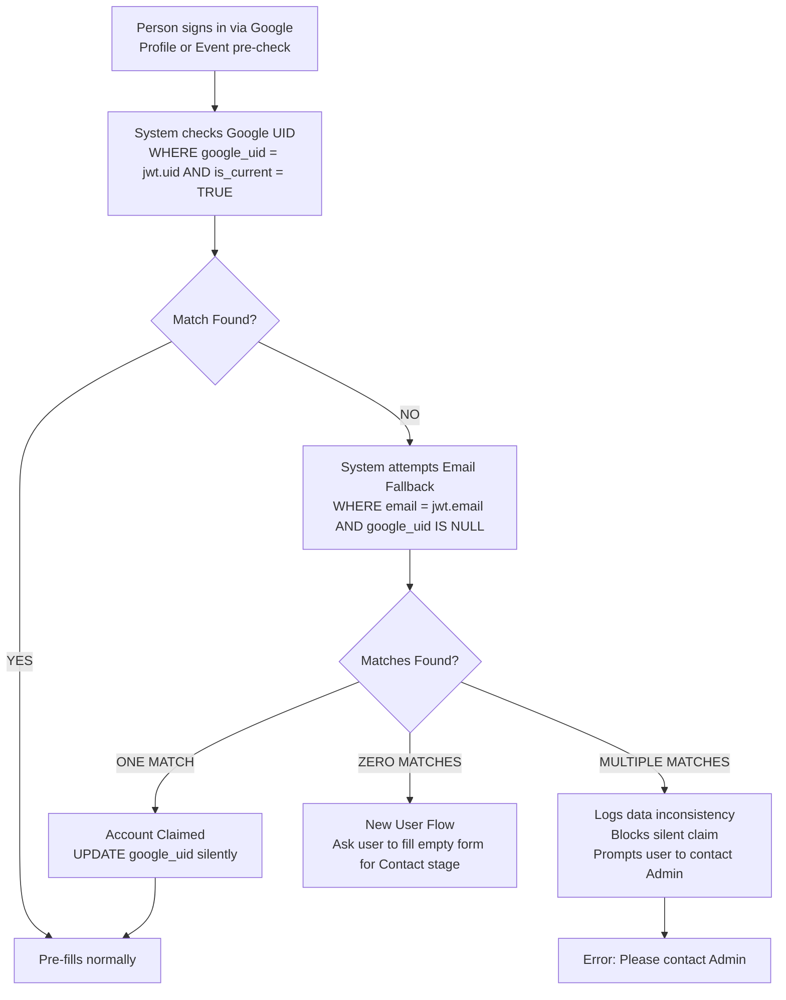
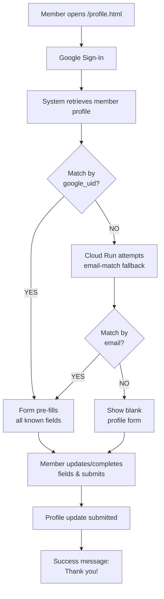

# Frontend & UX Flows — Phase 1 (Release Slices 1.01–1.08)

← Part of [ARCHITECTURE.md](../ARCHITECTURE.md) | See also: [UX_FLOWS.md](UX_FLOWS.md) · [API.md](API.md) · [JOURNEY_STAGES.md](JOURNEY_STAGES.md) · [EVENTS.md](EVENTS.md)

---

> [!NOTE]
> Detailed UX Flows for Phase 1 have been modularized. This document serves as the high-level roadmap and index.
> 
> - **[Phase 1 Public Event Registration](UX_FLOWS_PHASE1_REGISTRATION.md)**: Scenarios 1–4, Event Landing Page, Error Handling
> - **[Phase 1 Admin Event Management](UX_FLOWS_PHASE1_ADMIN_EVENTS.md)**: Event Status, Attendance, Direct Registration
> - **[Phase 1 Admin Persons & Review Queue](UX_FLOWS_PHASE1_ADMIN_PERSONS.md)**: Tabbed Review Queue, Duplicate Resolution, Person Edits, Role Assignments

---

## Phase 1.01 — Foundation: Auth + Skeleton Pages

| Page | Who Sees It | Access Control | Phase | Notes |
| :--- | :--- | :--- | :--- | :--- |
| `/e/[slug]` | Anyone | Google Sign-In | **Phase 1.01** | Public event landing shell — no nav. Register CTA enforces sign-in; full registration flow arrives in later slices. |
| `/profile.html` | Any authenticated person | Google Sign-In | **Phase 1.01 (shell), 1.04 (basic self-service)** | Starts as a shell page; basic self-service profile editing ships with registration writes. Enhanced stage-based enforcement is finalized in 1.08. |
| `/admin.html` | Admin only | Firebase Auth + role check (admin) | **Phase 1.01 (shell), 1.07–1.08 (core ops)** | Starts as a shell page; review queue lands in 1.07 and advanced person/role tools in 1.08. |
| `/events.html` | Admin only | Firebase Auth + role check (admin) | **Phase 1.01 (shell), 1.05–1.06 (core ops)** | Starts as a shell page; event setup/status controls land in 1.05 and attendance/manual registration in 1.06. |

## Phase 1 Release Slices (Implementation Order)

### Phase 1.01 — Foundation: Auth + Skeleton Pages
- Google Sign-In integration and Firebase Auth session handling.
- Route/page shells for `/e/[slug]`, `/profile.html`, `/admin.html`, and `/events.html`.
- Role gating baseline: public event page access, admin-only enforcement for `/admin.html` and `/events.html`.
- Standard sign-in failure handling (cancelled sign-in, popup blocked, network failures).

### Phase 1.02 — Event Read-Only Landing Page
- `/e/[slug]` resolves event by slug and shows hero image, event name, date/time, venue.
- Event status messaging for `closed`, `completed`, `cancelled`, and not-found states.
- `Register Now` CTA can remain a sign-in-gated stub.

### Phase 1.03 — Pre-check + Decision Screens (No Writes)
- End-to-end pre-check integration, including account-claiming fallback by email.
- Decision screens: Already Registered, Confirm Registration, Complete Profile, Brand New Person.
- Missing-field highlighting driven by pre-check response.
- No registration write operations yet.

### Phase 1.04 — Self-Service Registration Writes (Core Public MVP)
- Public registration write paths for new, incomplete-profile, and complete-profile persons.
- Minimal success screen and duplicate registration defenses.
- Mid-flow event closure/race-condition handling.
- Basic `/profile.html` self-service profile editing ships alongside this slice.

### Phase 1.05 — Admin Event Management
- `/events.html` supports event creation (default `closed`), hero upload, status transitions, and basic registration list.
- Public event page behavior reflects live admin-controlled status.

### Phase 1.06 — Attendance Marking + Admin Direct Registration
- Registration list actions: mark attended / no-show.
- Usability controls: filtering, search, and pagination.
- Admin direct registration flow (person search + duplicate guard).

### Phase 1.07 — Admin Review Queue MVP
- `/admin.html` review queue with Pending and Duplicates tabs.
- Rejected records audit view with restore path.
- Duplicate routing and optimistic UI + rollback error messaging.

### Phase 1.08 — Admin Person Record Power Tools
- Expanded admin person editing and stage transition actions.
- Role assignment/revocation for Admin and Executive.
- `Promote to VG Leader` direct action and role/stage mismatch repair guidance.

### Shortest Realistic MVP Cut
- **1.01 → 1.02 → 1.03 → 1.04 → 1.05** delivers the first complete operational loop: shareable event page, smart pre-check, registration writes, and admin event control.
- Add **1.06** for attendance operations, **1.07** for data quality stabilization, and **1.08** for scale-oriented admin power tools.

---

## UX Flows (Phase 1 Detailed Reference)

### Entry Points Summary

| Entry Point | URL | Who | Auth | Key Behavior | Document Reference |
| :--- | :--- | :--- | :--- | :--- | :--- |
| Event Landing Page | `/e/[slug]` | Anyone | Google Sign-In | Smart pre-check → profile form or confirm or already-registered screen. | [Phase 1 Registration](UX_FLOWS_PHASE1_REGISTRATION.md) |
| Member Profile | `/profile.html` | Any authenticated person | Google Sign-In | View and update own record. | [Phase 1 Registration](UX_FLOWS_PHASE1_REGISTRATION.md) |
| Admin Portal | `/admin.html` | Admin team | Google Sign-In + admin | Review queue, person editing, role assignment. | [Phase 1 Admin Persons](UX_FLOWS_PHASE1_ADMIN_PERSONS.md) |
| Admin Events | `/events.html` | Admin team | Google Sign-In + admin | Event configuration and attendance. | [Phase 1 Admin Events](UX_FLOWS_PHASE1_ADMIN_EVENTS.md) |

### Member Profile Form — `/profile.html`

> **Account-Claiming (admin-created records):** Account-claiming (email-match fallback) is triggered on profile load and event registration pre-check. On either action, if no record matches by `google_uid`, the system automatically attempts an email-match fallback against `persons WHERE google_uid IS NULL`. If a match is found, the `google_uid` is claimed silently and the form pre-fills normally. If no email match is found, the user is presented with a blank profile form to complete their initial registration (self-service profile creation). See [API.md](API.md) for the account-claiming flow.

> **Stage-dependent Facebook enforcement:** If the user's `journey_stage = 'contact'`, the Facebook field is shown with an "encouraged" label and is not required. If `journey_stage = 'member'` or higher, Facebook is **required** — the form submission is blocked until it is filled.

> **Profile completeness criteria — canonical field sets for `profile_complete` pre-check flag and `profile_completeness_pct` Silver formula:**
> *(See [SCHEMA.md](../docs/SCHEMA.md#profile_completeness_pct-formula-stg_personssqlx) for the full formula. Both the pre-check endpoint and the Dataform pipeline must derive from that definition. Any change to the required field sets must be applied to both locations simultaneously.)*
> - **Contact stage** (9 fields): `first_name`, `middle_name`, `last_name`, `address`, `birthdate`, `gender`, `civil_status`, mobile `person_contacts` record (`contact_type = 'mobile'`, `is_current = TRUE`), `persons.email`. `suffix` is excluded (form always pre-populates 'None'). Facebook is encouraged but non-blocking — not counted as required at this stage. `persons.email` is auto-captured from Google Sign-In and never shown as a form field (see field display rules below).
> - **Member stage** — adds 4 fields to contact requirements: `facebook` (`person_contacts` WHERE `contact_type = 'facebook'`, `is_current = TRUE`), `is_in_victory_group`, `employment_type`, plus one applicable conditional field (`nature_of_work` or `nature_of_business` — whichever matches `employment_type`; the inapplicable field is never counted).

**Field display rules:**
- All Contact-stage fields (first name, middle name, last name, suffix, address, contact number, birthday, gender, civil status) are shown pre-filled and editable — members may correct their own data.
- Facebook is shown pre-filled and editable. Shown with an "encouraged" label for contact-stage persons (non-blocking). Required and form-blocking for member-stage or higher.
- Email is **not shown as a form field** — it is silently captured from the Google Sign-In session (`persons.email` = Firebase Auth email). This enables a parent or spouse to register on behalf of a family member without requiring the family member to have their own Google account.

> **Proxy Registration (Register Someone Else):** Phase 1 includes a non-primary 'Register Someone Else' flow. This enables a parent or spouse to register a family member. When a proxy registers someone else, the proxy's `google_uid` must NOT be permanently bound to the family member's record. Instead, `persons.email` is stored as the proxy's email, but `google_uid` remains NULL for that new record. The actual registrant can claim their profile later via account-claiming once an admin manually updates `persons.email` to the actual registrant's email. Admins must be trained on this edge case to prevent operational friction when families register via proxy.

- "Are you part of a Victory Group?" maps to `is_in_victory_group BOOL` on `victory_silver.persons`. Does not affect `journey_stage`. Captured to report on contact-stage persons not yet in a Victory Group. NULL = not yet answered.
- Employment Type and conditional fields (Section 2) are always shown — these are the primary reason a member visits this page. For **contact-stage** persons: the section is shown but all fields are optional (non-blocking for form submission). For **member-stage or higher**: `employment_type` and the applicable conditional fields are required — the form is blocked until filled. For **employed**: `nature_of_work` and `company_name` are shown (both required). For **self-employed**: `nature_of_business` and `business_name` are shown (both required). The inapplicable pair is hidden entirely.
- A member cannot view or edit any other person's record. The form is scoped strictly to `google_uid` of the signed-in user.

**Form Dropdown Values Reference** — Canonical mapping of stored enum values to UI display labels:

| Field | Stored Value | UI Display Label |
| :--- | :--- | :--- |
| `suffix` | `(empty / NULL)` | None |
| `suffix` | `Jr.` | Jr. |
| `suffix` | `Sr.` | Sr. |
| `suffix` | `II` | II |
| `suffix` | `III` | III |
| `suffix` | `IV` | IV |
| `gender` | `M` | Male |
| `gender` | `F` | Female |
| `civil_status` | `single` | Single |
| `civil_status` | `married` | Married |
| `civil_status` | `widowed` | Widowed |
| `employment_type` | `employed` | Employed |
| `employment_type` | `self_employed` | Self-Employed |

The suffix dropdown always defaults to "None". `gender` and `civil_status` dropdowns have no default selection — admin or user must explicitly choose. `employment_type` has no default — the conditional fields (nature_of_work / nature_of_business) are hidden until a selection is made.

### Member Profile Form — Error Handling

#### Google Sign-In

| Condition | User Experience |
| :--- | :--- |
| User cancels Google Sign-In | Page returns to `/profile.html` landing with a **[ Sign In to View Your Profile ]** button re-enabled. No error message. |
| Network error during sign-in | Show inline error: *"Sign-in failed. Please check your connection and try again."* Re-enable sign-in button. |

#### Profile Load

| Condition | User Experience |
| :--- | :--- |
| `google_uid` match found | Form pre-fills normally. |
| No `google_uid` match, email match found (exactly one) | `google_uid` claimed silently. Form pre-fills from the matched record. No user-visible action. |
| No `google_uid` match, **multiple** email matches found | Show message: *"Unable to load your profile. Please contact your VG leader or an administrator."* Sign-in button re-enabled. No account claim performed. No google_uid is written. |
| No match at all | User is presented with a blank profile form to complete their initial registration (self-service profile creation). No error message is shown. |
| Server or network error | Show message: *"Unable to load your profile. Please check your connection and try again."* Retry button shown. |

#### Form Submission

| Condition | User Experience |
| :--- | :--- |
| Success | Show: *"Thank you, your profile has been updated."* Form fields remain pre-filled with the submitted values. |
| Client-side validation failure | Required field(s) highlighted with inline error labels. Submission blocked. No server call made. |
| Server error (5xx) | Show: *"Something went wrong. Please try again in a moment."* Form data is preserved — user does not need to re-enter. |
| Network error | Show: *"Unable to submit. Please check your connection and try again."* Form data preserved. |
