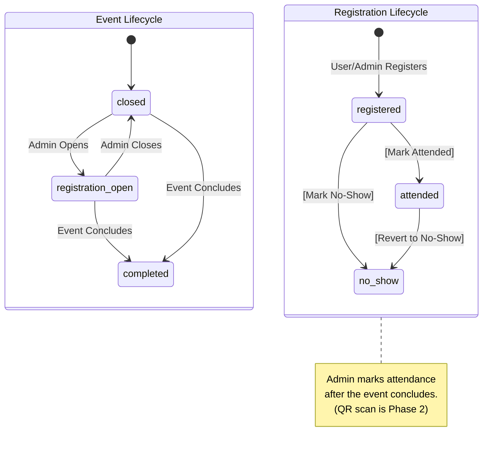

# UX Flows — Phase 1: Admin Event Management (1.05–1.06)

← Back to [UX_FLOWS_PHASE1.md](UX_FLOWS_PHASE1.md) | Part of [ARCHITECTURE.md](../ARCHITECTURE.md)

---

## Admin Event Management (`/events.html`)

Key admin actions on event records:

```plaintext
Admin actions:
  ┌──────────────────────────────────────────────────────────────────┐
  │  EVENT: Date Talk — February 2025                                │
  │  Status: registration_open  ·  Capacity: 200 (informational)    │
  │                                                                  │
  │  [ Open Registration ]    → status = registration_open          │
  │  [ Close Registration ]   → status = closed                     │
  │  [ Mark Completed ]       → status = completed                  │
  │  [ Cancel Event ]         → status = cancelled                  │
  │                                                                  │
  │  Hero image:  [ Upload Image ]  (sets hero_image_url)           │
  │               Note: if no image is uploaded and the event is set │
  │               to registration_open, the public page renders a    │
  │               branded placeholder automatically. Best practice:  │
  │               upload the hero image before opening registration. │
  │  Capacity:    [ Edit ]          (informational only — no enforcement) │
  │                                                                  │
  │  [ View Registrations & Mark Attended ] → opens Registration    │
  │   List View                                                     │
  └──────────────────────────────────────────────────────────────────┘
```

## Registration List View

(opened via `[ View Registrations & Mark Attended ]`):

```plaintext
┌──────────────────────────────────────────────────────────────────────────────┐
│  Registrations — Date Talk: February 2025                                    │
│  Total: 48 · 32 attended · 5 no-show · 11 registered                        │
│                                                                              │
│  Filter: [ All ▾ ]  (All / Registered / Attended / No-Show /                │
│                       Payment Pending*)                                      │
│  * "Payment Pending" filter: only shown when event is_paid = TRUE.           │
│    Returns registrations WHERE payment_status = 'pending'.                  │
│    Hidden entirely for free events (is_paid = FALSE).                       │
│  Search: [__________________________]                                        │
│                                                                              │
│  Name              Status        Registered At       Payment Status          │
│  ─────────────────────────────────────────────────────────────────────────  │
│  Juan Dela Cruz    attended      Jan 20, 2025        [ Paid ▾ ]             │
│  [ Mark No-Show ]                                    ← inline toggle        │
│                                                        (paid events only)   │
│                                                        options: Pending /   │
│                                                        Paid / Waived        │
│                                                        → PATCH payment_     │
│                                                          status on click    │
│                                                        Free events: "N/A"  │
│                                                        (read-only)          │
│  Ana Reyes         registered    Jan 21, 2025        [ Pending ▾ ]          │
│  [ Mark Attended ] [ Mark No-Show ]                                          │
│                                                                              │
│  ... (paginated, 25 per page)                                                │
│  [ ← Previous ]  Page 1 of 2  [ Next → ]                                    │
│                                                                              │
│                          [ + Register Person ]                               │
└──────────────────────────────────────────────────────────────────────────────┘
```

**Payment Status inline toggle behavior:**
- **Paid events** (`is_paid = TRUE`): The Payment Status cell on each registration row is an inline dropdown. Admin clicks to toggle between `Pending`, `Paid`, and `Waived`. Calls `PATCH /api/event-registrations/{id}` with `{ "payment_status": "<value>" }`. Optimistic update — label changes immediately, reverts on API failure with a toast error.
- **Free events** (`is_paid = FALSE`): Payment Status column shows `N/A` (read-only, no toggle).
- Payment status is an informational tag only. It does not affect `persons.journey_stage`, reporting pipeline, or any other system behavior. `amount_paid`, `payment_ref`, and `payment_method` remain optional admin-entry fields.

## Event Attendance (Post-Event Admin Action)

Attendance for all events (paid or free) is recorded by admin after the event concludes — not at the venue door. Admin marks who attended via the admin portal after the event.



Payment status is available on registrations for admin reference. Payment details are communicated through existing church channels (social media, announcements).

## Admin Direct Registration (`/events.html`)

Admin can register a person for an event directly — without the person self-registering via `/e/[slug]`. This covers phone-in registrations, bulk-seeding before an event opens, or registering persons who lack Google accounts.

**Entry point:** `[ + Register Person ]` button on the event's registration list view (accessible via `[ View Registrations & Mark Attended ]` from `/events.html`).

```plaintext
1. Admin opens /events.html → selects the event → clicks [ View Registrations & Mark Attended ].
2. Admin clicks [ + Register Person ].
3. Admin searches by name. Results return matching persons (pending or approved).
4. Admin selects the correct person from results.
5. Admin confirms: [ Confirm Registration ].
6. Registration created for the selected person.
7. Person appears immediately in the registration list.
```

- **No profile-completeness check:** Admin registration bypasses the `profile_complete` guard enforced on self-registration. Admin is responsible for ensuring the person is the intended registrant.
- **Duplicate guard:** If the person already has an active registration for this event (`status != 'cancelled'`), the system rejects the submission. Admin sees: *"This person is already registered for this event."*
- **Event status not enforced:** Admin can register persons regardless of `events.status` (e.g., even when `status = 'closed'`).
