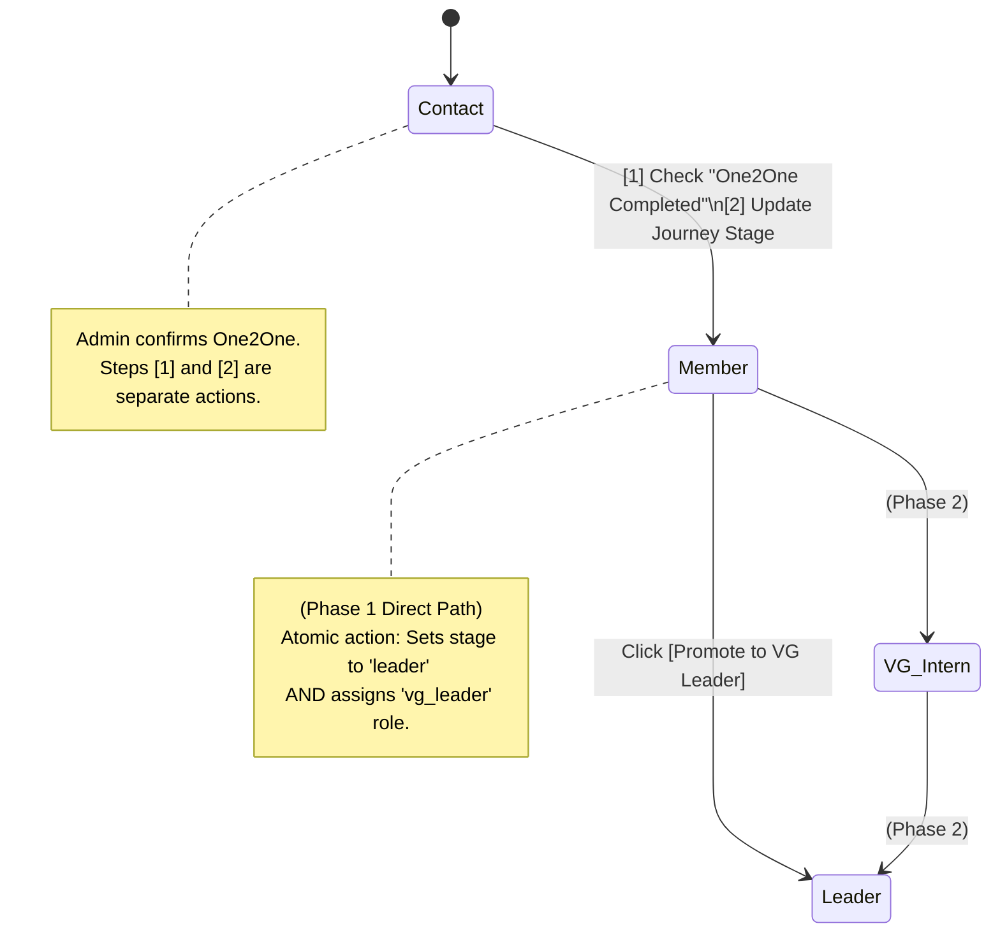

# UX Flows — Phase 1: Admin Persons & Review Queue (1.07–1.08)

← Back to [UX_FLOWS_PHASE1.md](UX_FLOWS_PHASE1.md) | Part of [ARCHITECTURE.md](../ARCHITECTURE.md)

---

## Admin Review Queue

> **Queue Badge (Navbar):** The `/admin.html` navigation displays a live badge count of actionable records: `[ Admin Portal (3) ]` where the count = Tab 1 (pending) + Tab 2 (duplicates) records. Sourced from `GET /api/admin/queue-counts` on page load. Badge updates after each Approve / Reject / Resolve action (optimistic). Badge is hidden (not shown as "0") when count = 0.

> **Phase 1:** Tab 1 (Pending Records) and Tab 2 (Duplicates) are required for MVP — all public event registrations and admin-created records flow through here.
> **Phase 2:** Tab 3 (Unresolved Interns), Tab 4 (Interns Without Active Relationship), and Tab 5 (Unlinked VG Members) activate when the VG Leader form ships in Phase 2.

Records created by **public forms** (event registration) start as `review_status = 'pending'`. The admin portal surfaces these records in a dedicated view. Admin-created records are created with `review_status = 'approved'` and do NOT appear in the review queue — they are immediately active in Silver.

The admin review queue is organized into tabs, each surfacing a distinct category of records requiring action.

> **Queue routing rule — Pending + Duplicate:** Records with both `review_status = 'pending'` AND `duplicate_flag = TRUE` appear **in Tab 2 only (Duplicates)**. They do NOT appear in Tab 1. This prevents admin from inadvertently approving a duplicate record before the duplicate is resolved. Once the duplicate is resolved (one record kept, one rejected), the kept record returns to Tab 1 if its `review_status` is still `pending`. (The kept record exits Tab 2 because its `duplicate_flag` is set to `FALSE` as part of the resolution transaction — it no longer satisfies the Tab 2 routing condition.)

```plaintext
┌──────────────────────────────────────────────────────────────────┐
│  ADMIN REVIEW QUEUE                                              │
│  [ Pending Records (2) ] [ Duplicates (1) ]                      │
│  ── Phase 2 tabs ──────────────────────────────────────────    │
│  [ Unresolved Interns (1) ] [ Interns Without Relationship (1) ] │
│  [ Unlinked VG Members (3) ]                                     │
│  ────────────────────────────────────────────────────────────    │
│                                                                  │
│  TAB 1 — PENDING RECORDS                                         │
│  New submissions awaiting admin review                           │
│  Filter: [ All ▾ ]  (All / Proxy Registrations)                 │
│                                                                  │
│  [ Maria Clara ]   Source: Form   Duplicate: NO                  │
│  [ Approve ] [ Reject ] [ Edit ]                                 │
│                                                                  │
│  [ Ana Santos ]    Source: Form   Duplicate: NO   [PROXY] ⚠️   │
│  ↑ [PROXY] badge shown when registration_source = 'proxy'.      │
│    Tooltip: "This person was registered by someone else.        │
│    Update their email to enable account-claiming."              │
│  [ Approve ] [ Reject ] [ Edit ]                                 │
│                                                                  │
│  ────────────────────────────────────────────────────────────    │
│                                                                  │
│  TAB 2 — DUPLICATES                                              │
│  Records where duplicate_flag = TRUE. Admin selects which        │
│  record to keep as canonical. The other is marked rejected.      │
│  Full merge is deferred to Phase 5.                              │
│                                                                  │
│  [ Juan Dela Cruz ]  Source: Event  Matches: Person #0001        │
│  ┌──────────────────────────┐  ┌──────────────────────────────┐  │
│  │  THIS RECORD             │  │  EXISTING RECORD #0001       │  │
│  │  Source: event_reg       │  │  Source: admin_created       │  │
│  │  Created: Jan 20 2025    │  │  Created: Mar 10 2024        │  │
│  │  google_uid: linked      │  │  google_uid: none            │  │
│  └──────────────────────────┘  └──────────────────────────────┘  │
│  [ Keep This Record ] [ Keep #0001 ]                             │
│  See Duplicate resolution rules below for full spec.             │
│                                                                  │
│  ────────────────────────────────────────────────────────────    │
│                                                                  │
│  TAB 3 — UNRESOLVED INTERNS (Phase 2)                           │
│  intern_relationships records where intern_person_id = NULL.     │
│  Name was typed by a leader but could not be auto-matched.       │
│  Must be linked before the relationship can be approved.         │
│                                                                  │
│  [ "Anna Reyes" ]  Leader: Pedro Santos  Source: leader_form     │
│  Search: [_______________] → [ Link to Person ]                  │
│  (Search returns a list of candidates — admin selects the        │
│   correct person; disambiguate by birthday or contact number     │
│   if names conflict.)                                            │
│  [ Create New Contact Record ]                                   │
│                                                                  │
│  ────────────────────────────────────────────────────────────    │
│                                                                  │
│  TAB 4 — INTERNS WITHOUT ACTIVE RELATIONSHIP (Phase 2)          │
│  Persons with journey_stage = 'intern' but no approved,          │
│  active intern_relationships record.                             │
│                                                                  │
│  [ Ben Cruz ]  Stage: intern  No active relationship found       │
│  [ View Pending Relationships ] [ Create Relationship ]          │
│                                                                  │
│  ────────────────────────────────────────────────────────────    │
│                                                                  │
│  TAB 5 — UNLINKED VG MEMBERS (Phase 2)                          │
│  victory_group_members records where person_id IS NULL           │
│  and is_active = TRUE. Leader submitted a member name that       │
│  has not yet been linked to a system person record.              │
│                                                                  │
│  [ "Anna Reyes" ]  Group: Group 1  Leader: Maria Clara           │
│  Search: [_______________] → [ Link to Person ]                  │
│  [ Create New Contact Record ]  [ Leave Unlinked ]               │
│                                                                  │
└──────────────────────────────────────────────────────────────────┘
```

### Tab 1 — Filter and Proxy Badge

- **Filter dropdown:** `[ All ▾ ]` with options: All / Proxy Registrations.
  - "Proxy Registrations" — shows only records WHERE `registration_source = 'proxy'`.
  - Purpose: Helps admin quickly identify records requiring email update before account-claiming can work.

- **[PROXY] badge:** Shown inline on records where `registration_source = 'proxy'`.
  - Tooltip on hover: *"This person was registered by someone else. Update their email to enable account-claiming."*
  - Resolution: Admin navigates to the person record via `[ Edit ]`, updates `persons.email` to the actual registrant's Google-linked email. Once updated, account-claiming fires automatically on the registrant's first Google Sign-In.

> **Account-claiming error (multiple email matches):** If a person's first sign-in triggers account-claiming and multiple `persons` records share the same email with `google_uid IS NULL`, the system returns a 409 error and shows: *"Unable to load your profile. Please contact your VG leader or an administrator."* No `google_uid` is written. An admin must investigate and resolve the duplicate email records manually before the person can sign in successfully.

### Tab 1 — Approve / Reject / Edit interaction spec

- **[ Approve ]** — No confirmation dialog (non-destructive). Record is removed from Tab 1 immediately (optimistic). Success toast: *"[Name] — approved."* The record is now active in Silver and included in all reporting. **On failure:** the optimistic removal is reverted (record reappears in Tab 1) and an inline error toast shows: *"Could not approve [Name]. Please try again."*

- **[ Reject ]** — Confirmation dialog required (destructive — excluded from all reporting until restored):
  ```
  Reject this record?
  [Name] will be excluded from active reporting.
  This can be reversed by an admin.

  Reason (optional): [____________________________]

  [ Cancel ]    [ Confirm Reject ]
  ```
  Record removed from Tab 1. Toast: *"[Name] — rejected."* Rejected records are accessible in a separate admin-only **"Rejected Records"** audit view (not a queue tab). Admin can restore by setting `review_status = 'pending'` — returns record to Tab 1.

- **[ Edit ]** — Navigates to the person's full record view in edit mode. Record remains `review_status = 'pending'` until explicitly approved or rejected. Edit save does not change `review_status`. On save, admin is returned to Tab 1. Approve/Reject decision must still be made separately.

### Admin Person Record — Editable Fields

Admin can directly edit the following fields from the person record view in edit mode:

| Field | Notes |
| :--- | :--- |
| `first_name`, `middle_name`, `last_name`, `suffix` | Direct data correction |
| `address` | Contact-stage field |
| `birthdate` | Contact-stage field |
| `gender` | Dropdown: Male / Female |
| `civil_status` | Dropdown: Single / Married / Widowed |
| `persons.email` | Editable for data-clean-up; not auto-re-captured |
| `is_in_victory_group` | Boolean toggle |
| `vg_leader_first_name`, `vg_leader_last_name` | Member-stage fields |
| `one2one_completed` | Boolean toggle (also sets `one2one_date`) |
| `one2one_date` | Date field |
| `employment_type` | Dropdown: Employed / Self-Employed. Changing this value creates a new occupation record and closes the previous one. |
| `nature_of_work`, `company_name` | Shown when `employment_type = 'employed'` (both fields present) |
| `nature_of_business`, `business_name` | Shown when `employment_type = 'self_employed'` (both fields present) |

The following are **not** directly editable inline — they have dedicated actions:

| Field / Action | Mechanism |
| :--- | :--- |
| `journey_stage` | Stage transition actions (see Admin Stage Transition Actions) |
| `review_status` | Approve / Reject buttons only |
| `roles` | Role Assignment section (Assign / Revoke buttons) |
| `google_uid` | Not editable by admin — set on first sign-in / account-claiming |

Mobile and Facebook contact records are shown in the "Contact Info" section and edited inline.

**Contact fields (mobile and Facebook):** Shown in a separate "Contact Info" section of the person record view. Edited inline. If no mobile record exists, admin sees an empty mobile field with an `[ Add ]` action. Validation: mobile field is free-text string (no server-enforced format in Phase 1); Facebook URL is free-text string.

### Duplicate resolution rules (Phase 1)
- Admin reviews both records side by side and selects which to keep as the canonical record.
- The kept record retains its `person_id`, `google_uid`, and all history.
- The rejected record is set to `review_status = 'rejected'` and `duplicate_of_person_id = <canonical_person_id>`. It is excluded from all Gold view reporting.
- The rejected record's event registrations and history are **not merged** in Phase 1 — they are excluded from counts. Full merge with history re-attribution is deferred to Phase 5 (see Implementation Phases in ARCHITECTURE.md).
- **`duplicate_flag` on the kept record is set to `FALSE` atomically** as part of the resolution action. The backend action for `[ Keep This Record ]` / `[ Keep #0001 ]` performs three writes in a single transaction: (1) sets the rejected record's `review_status = 'rejected'` and `duplicate_of_person_id`; (2) sets the kept record's `duplicate_flag = FALSE`. This is required for the Tab 2 routing rule to function correctly — a record with `duplicate_flag = TRUE` would remain in Tab 2 indefinitely regardless of `review_status`.
- Once a record is rejected as a duplicate, it is removed from the Duplicates tab and surfaced in a separate "Rejected Records" audit view accessible to admin only.
- After resolution, the kept record (now `duplicate_flag = FALSE`) routes to Tab 1 if `review_status = 'pending'`, or becomes an active approved record if `review_status = 'approved'`.

## Admin Portal — Person Record View: Special States

Three UI states on the admin person record view require explicit specification (Phase 1 sub-sections).

### Data Inconsistency Warning (Role / Stage Mismatch)

A person should have `journey_stage = 'leader'` if and only if they have an active `vg_leader` role in `victory_silver.person_roles`. If these are out of sync (e.g., due to a legacy data import or a failed promotion transaction), the admin portal surfaces a warning.

```plaintext
┌──────────────────────────────────────────────────────────────────┐
│  ⚠️  Data Inconsistency Detected                                  │
│  This person's role and journey stage do not match.              │
│                                                                  │
│  Role:          vg_leader (active)                               │
│  Journey Stage: member                                           │
│                                                                  │
│  Use the Promote action to resolve this mismatch.               │
│  [ Promote to VG Leader ]                                        │
└──────────────────────────────────────────────────────────────────┘
```

- **Trigger (Role ahead of Stage):** `person_roles` contains an active `vg_leader` row AND `persons.journey_stage ≠ 'leader'`.
- **Trigger (Stage ahead of Role):** `persons.journey_stage = 'leader'` AND no active `vg_leader` row in `person_roles`.
- **Location:** Inline warning banner at the top of the person record view.
- **Action:** `[ Promote to VG Leader ]` button performs an atomic promote operation (idempotent — re-running it corrects both fields). The button label is the same for both trigger cases. For the "Stage ahead of Role" case (person is already `journey_stage = 'leader'` but missing the role), the action assigns the missing role rather than performing a stage promotion — the operation handles both cases transparently.

### Member Stage Soft-Warning (Employment Info) — Phase 1

When admin sets `journey_stage = member` on a person record, the portal immediately checks whether `employment_type` is populated.

```plaintext
┌──────────────────────────────────────────────────────────────────┐
│  ⚠️  Employment Info Missing                                       │
│                                                                  │
│  This member's employment info has not been recorded.            │
│  Please collect and enter it, or ask the member to update        │
│  their profile at /profile.html.                                 │
│                                                                  │
│  [ Edit Record ]                              [ Dismiss ]        │
└──────────────────────────────────────────────────────────────────┘
```

- **Trigger:** Admin sets `journey_stage = 'member'` AND `employment_type` IS NULL.
- **Location:** Inline soft-warning displayed immediately after the stage transition is saved. Does **not** block the transition — admin may proceed.
- **Effect of leaving unresolved:** The record's `profile_completeness_pct` in admin views will remain low until the employment fields are populated, either by admin directly or by the member via `/profile.html`.
- **Resolution paths:** (1) Admin edits the record directly via the admin portal. (2) Member visits `/profile.html`, which pre-fills Section 2 (Employment Info) for them to complete and submit.

## VG Leader Promotion — Phase 1 Scope

> **Phase 1 (button only).** The **"Promote to VG Leader" button** is available in Phase 1 on any person's admin record view — admin can directly promote without requiring a form submission. This is how Phase 1 handles early data setup (admin creates person records manually and promotes directly). The button performs an atomic promotion action — sets `journey_stage = 'leader'` and assigns `vg_leader` role in a single operation.
>
> The **Data Inconsistency Warning** (role/stage mismatch) is also Phase 1 — it surfaces the promote button as a repair action regardless of whether the form was submitted.
>
> The **full 5-step promotion workflow** (Step 1: person submits VG Leader form → Step 2: admin approves → Steps 3–4: atomic promote → Step 5: intern closure inline prompt) is Phase 2 — see [UX_FLOWS.md — VG Leader Promotion](UX_FLOWS.md#vg-leader-promotion--intern-closure-inline-prompt-step-5).

## Admin Stage Transition Actions (Person Record View) — Phase 1

These are direct admin actions on a person's record view that drive stage progression. They are not surfaced via a queue — admin navigates to the person record and acts manually.



## Admin Create Person (`/admin.html`)

The `[ + Add New Person ]` button on `/admin.html` allows admin to seed a Contact-stage person record directly — before or without the person ever submitting a form themselves. This is the primary mechanism for pre-seeding records that members can later claim via account-claiming on first sign-in.

**Entry point:** `[ + Add New Person ]` button on `/admin.html`.

**Form fields:**

| Field | Required / Optional | Notes |
| :--- | :--- | :--- |
| `first_name` | **Required** | |
| `middle_name` | Optional | |
| `last_name` | **Required** | |
| `suffix` | Optional | Dropdown: None / Jr. / Sr. / II / III / IV |
| `address` | **Required** | |
| `birthdate` | **Required** | Date picker (YYYY-MM-DD) |
| `contact_number` | **Required** | Free-text; stored as `person_contacts` record with `contact_type = 'mobile'` |
| `email` | Optional | Used for account-claiming on first sign-in |
| `facebook_profile` | Optional | Stored as `person_contacts` record with `contact_type = 'facebook'` |
| `gender` | **Required** | Dropdown: Male / Female (same enums as `/profile.html`). No default selection — admin must explicitly choose. |
| `civil_status` | **Required** | Dropdown: Single / Married / Widowed. No default selection — admin must explicitly choose. |

**Behavior:**

```plaintext
1. Admin clicks [ + Add New Person ] on /admin.html.
2. Form opens (modal or dedicated page).
3. Admin fills required fields and any known optional fields → submits.
4. Form submitted to create the record.
5. Record created immediately — no review queue entry.
6. New person record opens in the admin view.
```

- **Duplicate email:** If `email` is provided and a record with that email already exists, the system rejects the submission. Admin should search for the existing record instead.
- **Account-claiming:** When the person later signs in with their Google account, the system will find this record (if `email` matches) and claim it silently by setting `google_uid`.

## Admin Role Assignment (Person Record View) — Phase 1

The Roles section on the admin person record view displays the person's currently active roles and allows admin to assign or revoke them directly. This covers standalone role assignment (`admin`, `executive`). The `vg_leader` role is assigned atomically via `[ Promote to VG Leader ]` and is NOT available in the dropdown.

```plaintext
┌──────────────────────────────────────────────────────────────────┐
│  ROLES                                                           │
│                                                                  │
│  Active roles:                                                   │
│  • vg_leader    Assigned by: Admin User   Jan 10, 2025           │
│    [ Revoke ]                                                    │
│                                                                  │
│  Assign additional role:                                         │
│  [ Select role ▾ ]  [ Assign Role ]                             │
│    ├─ Admin                                                      │
│    └─ Executive                                                  │
│                                                                  │
└──────────────────────────────────────────────────────────────────┘
```

**Assign role:**
- Admin selects a role from the dropdown (Admin, Executive) and clicks `[ Assign Role ]`.
- `vg_leader` is intentionally absent from the dropdown — it is assigned atomically via `[ Promote to VG Leader ]` (see VG Leader Promotion). If a `vg_leader` role/stage mismatch is detected, use the Data Inconsistency Warning repair action.
- Confirmation dialog:
  ```
  Assign Admin role to [Name]?
  This grants system access at the Admin level.

  [ Cancel ]    [ Confirm ]
  ```
- Role appears immediately in the Active roles list with `assigned_at` timestamp.

**Revoke role:**
- Admin clicks `[ Revoke ]` on an active role row.
- Confirmation dialog:
  ```
  Revoke Admin role from [Name]?
  They will lose system access at this level.

  [ Cancel ]    [ Confirm Revoke ]
  ```
- Role is removed from the Active roles list immediately.
- **Note:** Revoking `vg_leader` via this button (if shown for repair purposes) does NOT revert `journey_stage`. If `journey_stage = 'leader'` remains after revocation, a Data Inconsistency Warning will surface on the person record. Admin must resolve the mismatch using the promote action or a direct stage edit.
