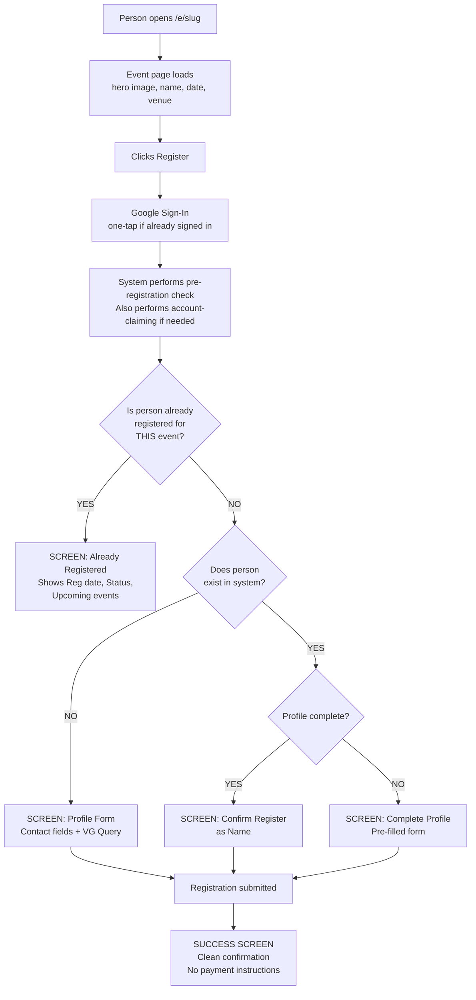
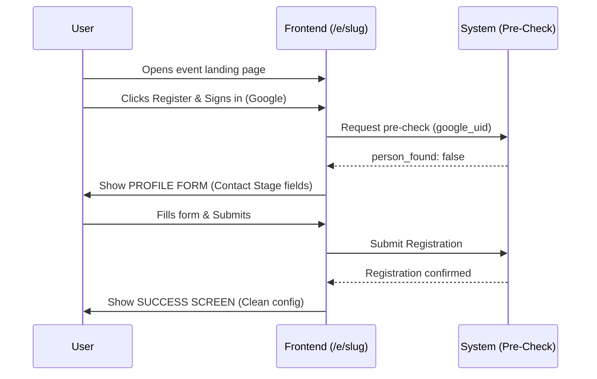
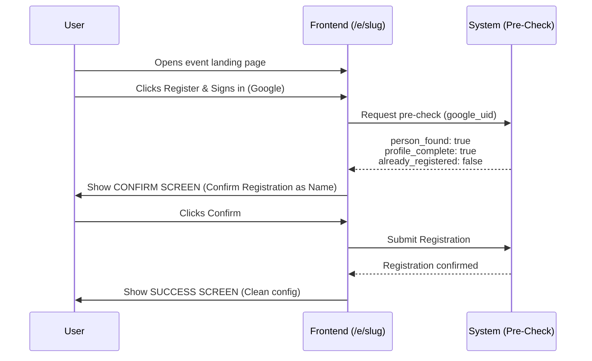
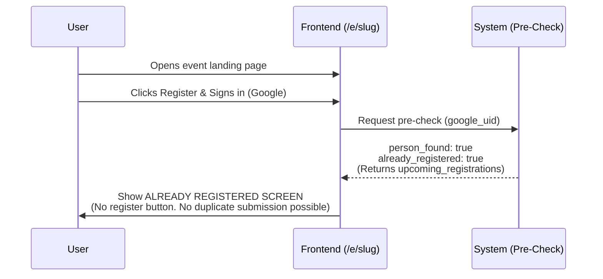
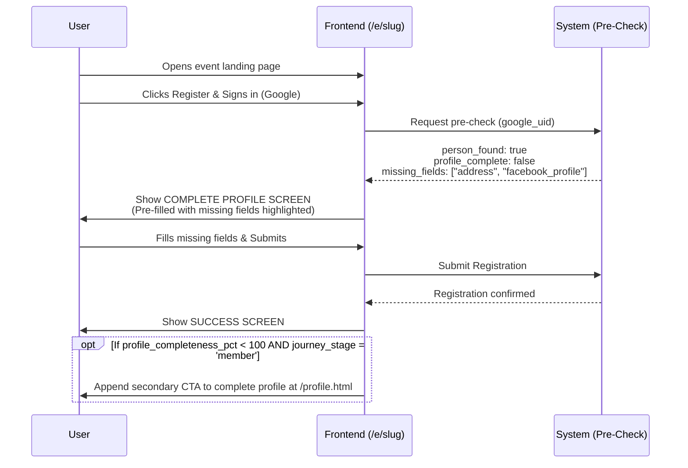
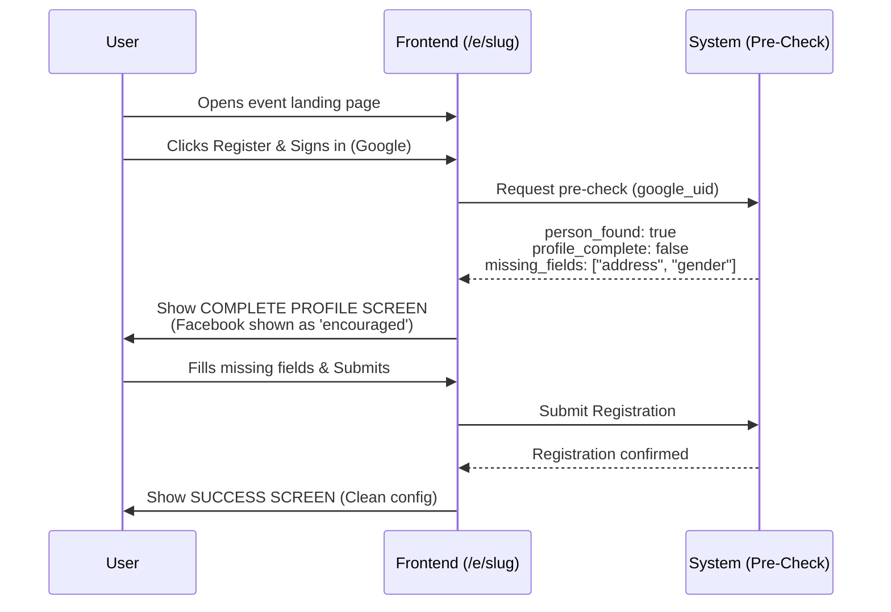

# UX Flows — Phase 1: Public Event Registration (1.02–1.04)

← Back to [UX_FLOWS_PHASE1.md](UX_FLOWS_PHASE1.md) | Part of [ARCHITECTURE.md](../ARCHITECTURE.md)

---

## Event Page Design

```plaintext
Admin's job                          Creative team's job
─────────────────────────────────    ──────────────────────────────────
Create event in portal               Design event artwork in Canva
System auto-generates page_slug      Export as image, send to admin
Upload Canva-designed hero image     Admin uploads it — page is live
Set status = registration_open       Creative team never touches code
Copy URL → hand to comms team        Zero developer required
```

## Event Landing Page Layout (`/e/[slug]`)

> **Hero image rendering rule:** If `events.hero_image_url` is not NULL, render the uploaded image at full width. If `hero_image_url` IS NULL, render the branded fallback placeholder at `/assets/images/event-hero-placeholder.png` (1200×630px, 16:9). The placeholder is the safety net for events opened before a hero image is uploaded — it is never shown in normal operation if admin follows the recommended workflow.

```plaintext
┌─────────────────────────────────────────┐
│   [Canva Hero Image or Placeholder]     │
│                                         │
│  Event Name                             │
│  Date & Time · Venue                    │
│  (Admin-uploaded hero image fills the   │
│   visual context — Phase 2+: description│
│   field not in schema for Phase 1)      │
│                                         │
│  ┌─────────────────────────────┐        │
│  │   [ Register Now ]          │        │
│  └─────────────────────────────┘        │
│                                         │
│  No payment instructions displayed.     │
│  No site navigation.                    │
└─────────────────────────────────────────┘
```

## Event Registration Flow — Complete Decision Tree

> **Facebook field — stage-aware enforcement:** Facebook Profile is non-blocking for event registration by Contact-stage persons. The pre-check endpoint does not include `facebook_profile` in `missing_fields` and does not affect `profile_complete` for persons with `journey_stage = 'contact'`. For persons at `journey_stage = 'member'` or higher, Facebook is required and will appear in `missing_fields` if absent.

> **Event registration `profile_complete` scope — CONTACT-STAGE CRITERIA ONLY:** The pre-registration check evaluates `profile_complete` using **contact-stage criteria only** (9 fields: `first_name`, `middle_name`, `last_name`, `address`, `birthdate`, `gender`, `civil_status`, mobile `person_contacts` record, `persons.email`), regardless of the person's `journey_stage`. Employment fields (`employment_type`, `nature_of_work`, `nature_of_business`) **never appear in `missing_fields` for event registration** — even for member-stage persons. Member-stage profile completeness (which includes these 4 additional fields) is enforced exclusively at `/profile.html`. This design prevents an unresolvable UX state: a member-stage person missing employment data can still complete registration (those fields are not shown on the event form), and is separately prompted to complete their full profile at `/profile.html`. See [API.md](API.md) for the full pre-check response schema.



## Event Registration — Error Handling

### Google Sign-In Failure or Cancellation

| Condition | User Experience |
| :--- | :--- |
| User cancels Google Sign-In dialog | Sign-in modal closes. Page returns to event landing with **[ Register Now ]** button re-enabled. No error message. |
| Network error during sign-in | Show inline error: *"Sign-in failed. Please check your connection and try again."* Re-enable **[ Register Now ]** button. |
| Popup blocked by browser | Show inline message: *"Your browser blocked the sign-in popup. Please allow popups for this site and try again."* |

No registration data is written on failure. The user may retry without page reload.

### Event Page — Not Found or Closed

| Condition | User Experience |
| :--- | :--- |
| Event slug does not exist | Show page: *"This event page could not be found. The link may be incorrect or the event may no longer be available."* No Register button. |
| Event `status = closed` | Show event details (hero image, name, date) with message: *"Registration for this event is now closed."* No Register button. |
| Event `status = completed` | Show event details with message: *"This event has already taken place."* No Register button. |
| Event `status = cancelled` | Show message: *"This event has been cancelled. Please check with your Victory Group leader for updates."* No Register button. |

### Pre-Check and Registration Failures

| Condition | User Experience |
| :--- | :--- |
| During pre-check — matched record is rejected (`review_status = 'rejected'`) | Show inline error: *"Unable to process registration at this time. Please contact your VG leader or an administrator."* Re-enable **[ Register Now ]** button. No registration data written. |
| During pre-check — account-claiming found multiple email matches | Show inline error: *"Unable to load your profile. Please contact your VG leader or an administrator."* Re-enable **[ Register Now ]** button. No registration data written. No `google_uid` is written. |
| During pre-check — server error (5xx) | Show inline error: *"Something went wrong. Please try again in a moment."* Re-enable **[ Register Now ]** button. No registration data written. |
| During pre-check — network error / timeout | Show inline error: *"Unable to reach the server. Please check your connection and try again."* Re-enable **[ Register Now ]** button. |
| During registration submit — server error (5xx) | Show inline error on the Confirm or Complete Profile screen: *"Something went wrong. Your registration was not submitted. Please try again."* Form data preserved — user does not need to re-enter. Do not navigate away from current screen. |
| During registration submit — network error / timeout | Show inline error: *"Unable to submit. Please check your connection and try again."* Form data preserved. Do not navigate away from current screen. |
| Duplicate registration (defensive) | Show inline message: *"It looks like you're already registered for this event."* No duplicate registration created. User may safely dismiss and navigate away. |
| Event status changed mid-flow (race condition) | Event was open when the page loaded but closed before the submit completed. Show inline error: *"Registration for this event is now closed."* Re-enable **[ Register Now ]** button. No registration data written. |

No registration data is written on pre-check or self-register failure. The user may retry without page reload. After a failed pre-check, the user is returned to the **[ Register Now ]** button state and can re-initiate the flow.

## Scenario 1 — Brand New Person



> **Backend note — `full_name` computation (two-phase write):** When the backend creates the minimal Silver `persons` record for a new user, `full_name` MUST be computed and included in the INSERT (`NOT NULL` constraint). Formula: `TRIM(CONCAT_WS(' ', first_name, middle_name, last_name, suffix))` where `suffix` is omitted if `NULL` or `'None'`. This same formula applies to `POST /api/persons` (admin create) and all SCD2 new-row inserts when any name field changes. See [API.md](API.md) for the canonical formula reference.

## Scenario 1b — Brand New Person (Proxy Registration)

> *A parent or spouse registers on behalf of a family member. The proxy's `google_uid` must NOT be permanently bound to the family member's record.*

The profile form screen (Scenario 1) presents a secondary option:

```plaintext
  [ Registering for yourself? ]         ← default, selected
  [ Registering for a family member? ]  ← secondary option
```

When **"Registering for a family member"** is selected:
- Email field remains hidden (same as self-registration — email is never a visible form field).
- The **family member's** name, address, contact, and other details are filled into the form.
- On submit, a new `persons` record is created: `google_uid = NULL`, `persons.email` = proxy's JWT email. This is intentional — the family member does not yet have a Google account linked.
- `registration_source = 'proxy'` on the `event_registrations` INSERT.
- The success screen shows the **family member's name** (not the proxy's).

**Admin resolution path (required to enable account-claiming for the family member):**
1. Admin sees a **[PROXY]** badge on the Tab 1 pending record.
2. Tooltip: *"This person was registered by someone else. Update their email to enable account-claiming."*
3. Admin obtains the actual registrant's Google-linked email and updates `persons.email` via the person record edit view.
4. On the family member's first Google Sign-In, account-claiming fires automatically and links their `google_uid`.

> **Data safety:** The proxy's `google_uid` is never written to the family member's `persons` record. Only `persons.email` is temporarily set to the proxy's email as a placeholder for the admin to update.

## Scenario 2 — Returning Person, Complete Profile, NOT Registered



**Note on `upcoming_registrations` on the Confirm Screen:** This list excludes the current event being registered for (since registration has not yet been submitted). After successful registration, the current event appears in `upcoming_registrations` — as shown in Scenario 3's Already Registered screen.

## Scenario 3 — Returning Person, ALREADY Registered for This Event



## Scenario 4 — Returning Person, Incomplete Profile

> *This scenario assumes the returning person is at `journey_stage = 'member'` or higher — which is why `facebook_profile` appears in `missing_fields` as a required field. Note: employment fields do **not** appear in `missing_fields` even for member-stage persons — pre-check uses contact-stage criteria only. See pre-check scope note above.*



**Note on employment fields in this screen:** The Complete Profile screen does not show the employment section, even for member-stage persons. Pre-check uses contact-stage criteria only. Employment and VG leader fields are enforced exclusively at `/profile.html`.

## Scenario 4b — Returning Person (Contact Stage), Incomplete Profile

> *Applies when `person_found: true`, `profile_complete: false`, and `journey_stage = 'contact'`. Facebook appears as "encouraged" (non-blocking) — it will NOT appear in `missing_fields` for contact-stage persons.*



Key difference from Scenario 4: Facebook is shown as "encouraged" (non-blocking). Pre-check does not include `facebook_profile` in `missing_fields`. No employment section is shown — that is a member-stage requirement.

## Success Screen — All Scenarios

The success screen is intentionally minimal. No payment instructions, no GCash numbers, no bank transfer details are shown on this screen.

```plaintext
┌─────────────────────────────────────┐
│                                     │
│            ✅                       │
│                                     │
│  You are registered for             │
│  Date Talk — February 2025!         │
│                                     │
│  📅 February 15, 2025 · 2:00 PM    │
│  📍 Victory Taguig                  │
│                                     │
│  See you there!                     │
│                                     │
└─────────────────────────────────────┘
```

Why no payment instructions on the success screen: Payment details (GCash numbers, bank accounts) are communicated through the church's existing channels — social media announcements, event descriptions, or in-person communication. The registration system focuses purely on confirming attendance intent. This keeps the success screen clean, reduces confusion, and avoids displaying sensitive financial information on a public-facing page.
